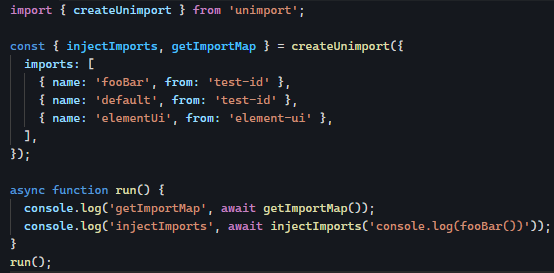
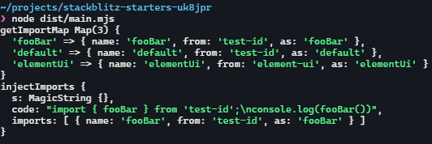
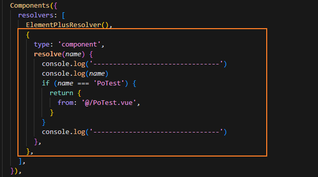
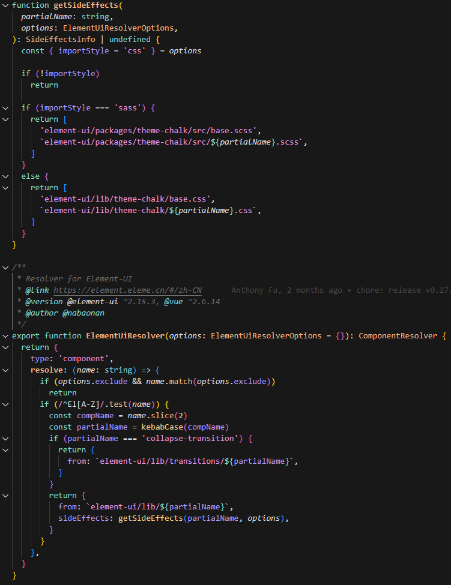
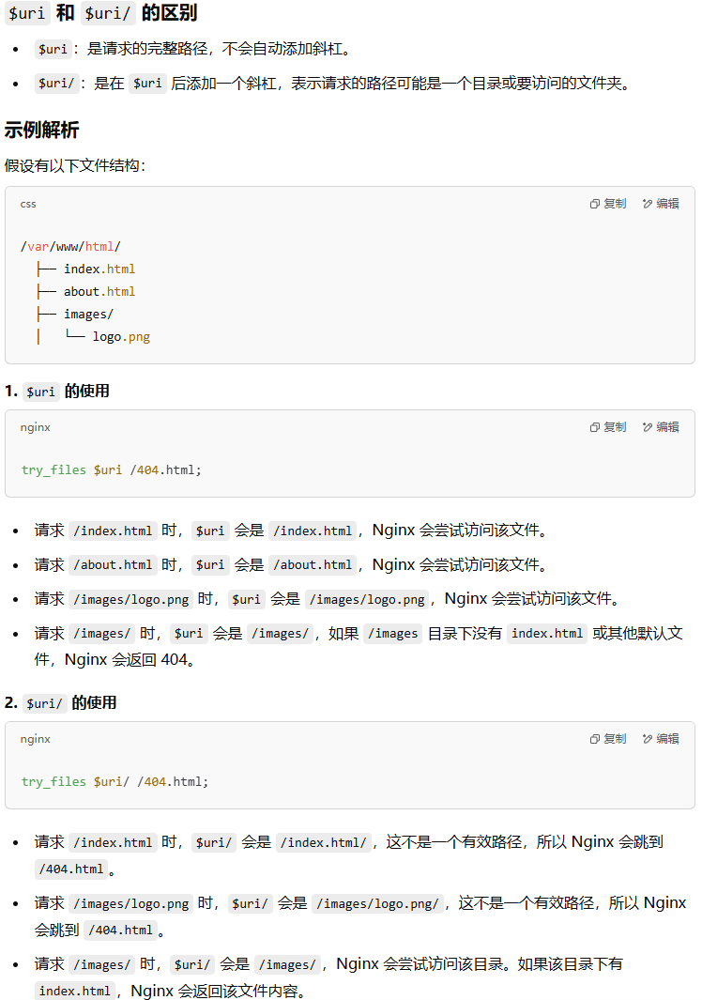

# 一些实践项目的学习

## 不错的vue管理后台项目

[vue-pure-admin-前端](https://github.com/pure-admin/vue-pure-admin)，`vue3 + element-plus`有精简版、完整版。功能很全面。

[vue3-antdv-admin-前端](https://github.com/buqiyuan/vue3-antdv-admin)，`vue3 + antd-vue`，有一些任务调度、编排、日志记录等功能可以参考，还有配套`nestjs`[后端项目](https://github.com/buqiyuan/nest-admin)，能学到很多。

## UI设计

一些免费svg矢量图：[https://undraw.co/illustrations](https://undraw.co/illustrations)

便捷的vue3动画效果库：[@vueuse/motion](https://motion.vueuse.org/)


## 工程化构建

### 动态导入

#### unplugin-auto-import和unimport

根据官方文档，`unimport`能解决动态导入js变量（具体见[文档](https://github.com/unjs/unimport)）：





上图例子中`element-ui`实际没有被使用，被过滤摇掉了。`unplugin-auto-import`主要用于给各打包工具结合使用，`unplugin`是用于创建一个通用标准的插件，这样就不用vite、webpack等打包工具每个都写一套代码。

#### unplugin-vue-components

这个主要是用来动态导入vue组件或指令，具体见[文档](https://github.com/search?q=unplugin-vue-components)。

可以用`dirs`属性指定动态导入查找组件的位置，默认`src/components`，当然除了`dirs`也可以自己指定`resolver`，下面写了个`PoTest.vue`放在`src/`下，就不会自动导入，通过自定义`resolver`去做处理：



此外还可以指定`sideEffects`，例如`element-ui`为例的resolver可以附加导入样式文件：



## 一些小功能

### 全屏原理

点击按钮，网页就全屏。本质上是用了`@vueuse/core`中的`useFullscreen`，底层通过`document.fullscreenElement`判断是否全屏，通过`document.documentElement.requestFullscreen`和`document.documentElement.exitFullscreen`实现全屏。主要处理了兼容性问题。

### 主题色

全局通过CSS变量`--el-color-primary-xx`设置主题色，切换主题时，动态更改`--el-color-primary-xx`的值。


<!-- ## 登录设计

前端划分为静态路由和动态路由，静态路由在页面加载时就初始化完毕，然后`router.beforeEach`中获取`localStorage`中的用户信息，如果没有跳转登录；如果有，就加载后端动态路由，通过`addRoute`动态添加路由。

> 这里并不是每次beforeEach都调接口获取后端路由，会判断没有`from.name`才会走到这个路径，正常页面内跳转是有`from.name`的。

路由权限方案感觉可以参考nuxt等等。 -->

## ------------------------------------------

层叠上下文展示顺序

浏览器解析顺序与事件循环与requestAnimationFrame

devicePixelRatio项目中怎么运用

http2头帧


react源码、原理
vue源码、原理，为什么不需要fiber架构
react生态
项目实践


### Redux

createStore传递一个根reducer，每个reducer接收当前state和要处理的action，返回新的state；
随着模块增多，根reducer下面又按模块拆分成了多个slice（其实就是多个模块reducer），然后通过combineReducers合并成一个根reducer。

因为redux很难用，官方又出了 @reduxjs/toolkit

### 渲染

纯服务端渲染：在服务端生成html返回，客户端每次点击跳转都会刷新页面
纯客户端渲染：在客户端生成html，客户端点击跳转不会刷新页面
同构渲染：服务端生成首屏html，客户端渲染html及加载js，进行react/vue的节点激活

Nextjs：
1. 服务端预渲染，静态站点生成
2. 增量静态生成

### zagjs

find-packages
plop
@changeset/cli处理monorepo版本发包
clean-package处理发包前的package.json

### Nginx

Nginx匹配优先级：精确匹配 (=) > 前缀匹配（^~）> 正则匹配（~/~*） > 普通匹配 > 根匹配 (/)

nginx反向代理： ^~ /xxx/ ，访问 /xxx 会301重定向到 /xxx/，可以用正则匹配 ~ /xxx(/.*)?

rewrite写法： `rewrite ^/api(/.*) $1 break;`，其中`break`表示重写为`$1`后不再回归匹配，还有个选项是`last`，表示`$1`再重新进入nginx其他location匹配规则。

常见示例：

```conf
location = /admin {
    rewrite ^/admin$ /admin/ last;
}
location /admin/ {
    alias E:/IT/Main/rumble/apps/web-admin/dist/;
    index index.html;
    try_files $uri $uri/ /admin/index.html;
}
```

访问`/admin/abc`时，`alias`表示访问`E:/IT/Main/rumble/apps/web-admin/dist/abc`，`root`表示访问`E:/IT/Main/rumble/apps/web-admin/dist/admin/abc`。



### Docker

```shell
docker run -p p1:p2 -d image_name
```

`p1`是暴露端口，`p2`是容器内端口。
