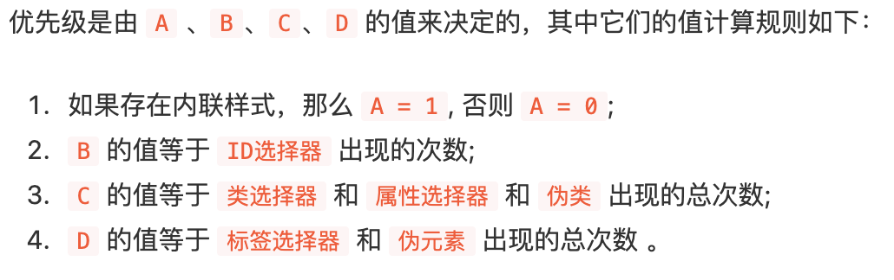
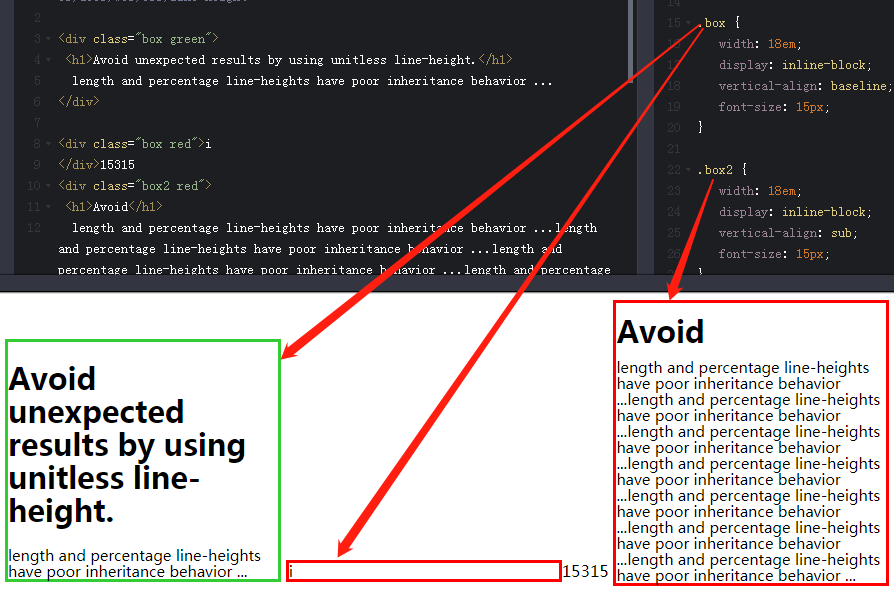
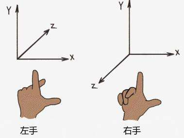
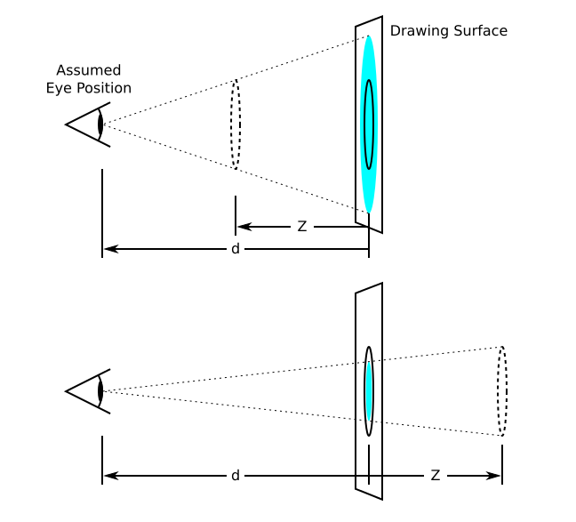
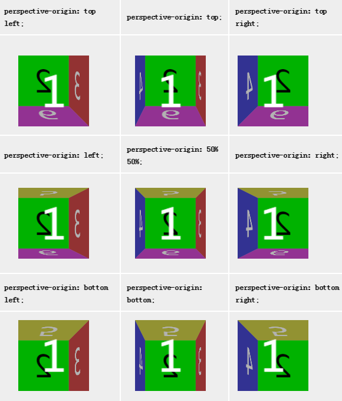
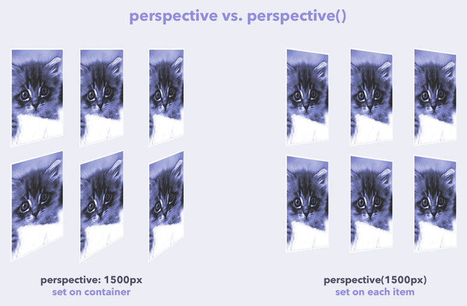

# CSS基础小记

## 盒模型

### 概念

当对一个文档进行布局的时候，浏览器渲染引擎会根据CSS-Box模型（CSS Basic Box model）将所有元素表示为一个矩形盒子，这样的盒子具有 内容区域(Content)、内边距区域(Padding)、边框区域(Border)和外边距区域(Margin)，如图所示：


基于该盒模型，CSS的width属性计算又依据两套标准：

```
标准模型(content-box)：
	该标准下，CSS设置的盒宽度 = content 宽度
IE模型(怪异模型)(border-box)：
	该标准下，CSS设置的盒宽度 = (content + padding + border) 宽度
```

在CSS3中可以通过box-sizing改变盒宽计算标准，box-sizing: content-box | border-box | inherit

### 相关术语

通过MDN文档，可以看到许多易混淆且难理解的术语，特此总结：

* 替换元素

  浏览器根据元素的标签和属性，来决定元素的具体显示内容，例如 img,input,select 等元素。

* 非替换元素

  非替换元素通常将内嵌内容直接显示于文档中，例如 span,a,div 等元素。

* 块级元素

  即 display 为 block、list-item、table的元素。一个块级元素会被格式化成一个块（例如文章的一个段落），默认按照垂直方向依次排列。

* 块级盒

  每个块级元素都至少生成一个块级盒子，即主块级盒子。每个块级盒子都会参与块格式化上下文（BFC）的创建。有些块级元素除了产生主块级盒，也可能产生额外的盒，比如display属性值为“list-item”的元素。产生的额外的盒用来包含项目符号（可以用list-style-position属性设置额外的盒是放在主块级盒内还是外）

* 行内级元素

  即 display 为 inline、inline-block、inline-table 的元素。

* 行内级盒

  行内级元素产生行内级盒，而行内级盒根据是否参与行内格式上下文（IFC）的创建又分为行内盒与原子级行内盒。

* 行盒

  在行内格式化上下文中,盒从包含块的顶部一个接一个地水平摆放。包含了一行里所有盒的矩形区域被称为行盒，一个段落就是多个行盒的垂直堆叠。


## BFC/IFC

**块级盒**会参与形成**BFC（块级格式化上下文）**，比如display值为block，list-item，table的元素；**行级盒**会参与形成**IFC（行内级格式化上下文）**，比如display值为inline，inline-table，inline-block的元素

### BFC布局规则

* 内部的盒子会在垂直方向，一个个地放置；
* 盒子垂直方向的距离由margin决定，属于同一个BFC的两个相邻Box的上下margin会发生重叠；
* 每个元素的左边，与包含的盒子的左边相接触，即使存在浮动也是如此；
* BFC的区域不会与float重叠；
* BFC就是页面上的一个隔离的独立容器，容器里面的子元素不会影响到外面的元素，反之也如此；
* 计算BFC的高度时，浮动元素也参与计算。

### BFC形成方式

* 根元素；
* float的属性不为none；
* position为absolute或fixed；
* display为inline-block，table-cell，table-caption，flex；
* overflow不为visible。


## 选择器

### 浏览器选择器优先级规则



> 例子：#nav-global > ul > li > a.nav-link
>
> 因为没有内联样式，故A = 0；
> ID选择器总共出现了1次，B = 1；
> 类选择器1次，属性选择器0次，伪类选择器0次，所以 C = 1 + 0 + 0 = 1；
> 标签选择器3次， 伪元素0次，所以 D = (3 + 0) = 3
>
> 即（0, 1, 1, 3）

### 选择器解析顺序

CSS选择器是**从右往左**解析的。

给出如下一段HTML：

```html
<div id="div1">
    <div class="a">
        <div class="b">
            ...
        </div>
        <div class="c">
            <div class="d">
                ...
            </div>
            <div class="e">
                ...
            </div>
        </div>
    </div>
    <div class="f">
        <div class="c">
            <div class="d">
                ...
            </div>
        </div>
    </div>
</div>
```

给出如下CSS样式声明：

```css
#div1 .c .d {}
.f .c .d {}
.a .c .e {}
#div1 .f {}
.c .d{}
```

假如我们的CSS解析器是**从左往右**进行匹配的，则会生成如下样式树：


可以看出`#div1 .c .d{}`， `.f .c .d{}`，`.c .d{}`这三个选择器里面都含有` .c .d{}`公用样式。因此即使我们的DOM节点已经明确了，在计算该DOM所拥有的样式时，仍需遍历整个样式树。性能不佳。

而当CSS解析顺序为**从右向左**时，将生成样式树：


不仅树节点少了，且在遍历性能上也能得到提升。


## 常见CSS细节问题

### line-height的继承

line-height即为行高，不支持负值：

  ```
  line-height可取值：normal | inherit | 纯数字 | 百分比 | 具体length
  
  当被定义为normal时：		行高将使用默认值，约纯数字1.2左右
  当被定义为inherit时：		将继承自父元素行高
  当被定义为纯数字时：		  即为当前字体大小的数字倍
  当被定义为百分比时：		  即纯数字的百分比版本
  当被定义为具体length时：	   即为具体值
  
  在继承上的体现：
  1. 父元素行高为具体length时，子元素均按此值继承
  2. 父元素行高为百分比时，子元素将继承父元素百分比算出来的具体值，而不会根据自身字体大小计算行高
  3. 父元素行高为纯数字和normal时，子元素均会根据自身字体大小计算该数字倍数相应的行高
  ```

### vertical-align

该属性针对于行内级元素（inline, inline-block）的纵向对齐方式：


| vertical-align 取值 | 位置                                                |
| ------------------- | --------------------------------------------------- |
| baseline            | **默认**，元素放置在父元素的基线上                  |
| sub                 | 垂直对齐文本的下标                                  |
| super               | 垂直对齐文本的上标                                  |
| top                 | 把元素的顶端与行中最高的元素的顶端对齐              |
| text-top            | 把元素的顶端与top line对齐                          |
| middle              | 把元素放置在父元素的中部                            |
| bottom              | 把元素的顶端与行中最低的元素的顶端对齐              |
| text-bottom         | 把元素的底端与bottom line对齐                       |
| length              | 基于基线往上的距离                                  |
| %                   | 使用“line-height”属性的百分比值来排列元素，允许负值 |
| inherit             | 继承于父元素的vertical-align                        |

`vertical-align: baseline`可以理解为将该行内级元素的baseline与该行正常DOM文本节点的基线对齐，对于该元素的baseline有以下规则：

* inline-table元素的baseline是它的table第一行的baseline；
* 对于是行盒的父元素，baseline是最后一个inline元素的baseline；
* inline-block元素如果内部有正常流内容（文字等），baseline取最后一个内容的baseline；
* inline-block元素若内部无流内容，baseline取它的底外边距边缘；
* inline-block如果设置了overflow不为visible，baseline取它的底外边距边缘。



参考：<a href="https://christopheraue.net/design/vertical-align" target="_blank">文章1</a> 和 <a href="https://www.cnblogs.com/starof/p/4512284.html?utm_source=tuicool&utm_medium=referral" target="_blank">文章2</a>

### width: 100% VS width: auto

width: 100%意味着content box撑满父容器的content box，而width: auto则是content + padding + border + margin 撑满父容器的content box。

### white-space & word-break & word-wrap

white-space：可以控制**空白字符**的显示及**语句**的换行（若单词过长会溢出）

word-break：可以控制单词内部的换行（是否在连字符、空格间换行或溢出则换行）

word-wrap (overflow-wrap)：可以实现`只有当一个单词一整行都显示不下时，才会拆分换行该单词`效果

### 百分比基准

1. 子元素的宽高设置百分比是基于父元素的宽高；
2. margin: 10% 10%中两个10%均基于父元素**宽度**计算，padding同理；
3. 在translate中设置的百分比是基于自身的宽高。

### 行内元素空隙问题

1. 设置font-size: 0；
2. 行内间隙即基线到底线间隙，可用vertical-align: bottom；
3. 利用HTML注释`<!-- -->`。


## 浮动

浮动的盒子可以向左或向右移动，直到它的外边缘碰到包含它的盒子或另一个浮动盒子的边框为止。由于浮动盒子不在文档的普通流中，所以文档的普通流中的块盒子表现得就像浮动盒子不存在一样。需注意：

* 一行内，显示不下所有的已浮动元素时，最后一个将换行；
* 元素一旦浮动起来之后，那么宽度将变成自适应(宽度由内容决定)；
* 元素一旦浮动起来之后，那么就将变成块级元素,尤其对行内元素，影响最大；
* 文本、行内元素、行内块元素是采用环绕的方式来排列的，故会巧妙的避开浮动元素而不被压在底下。

### 清除浮动

clear 属性规定元素的哪一侧不允许其他浮动元素。通常清除浮动有以下几种方式：

* 父元素内追加子元素并设置`clear: both;`，然而该方式会增加无意义标签；

* 为父元素设置overflow而产生BFC，使浮动元素高度也被计算在内；

* 为父元素设置伪类（也可通过原子类方式设置）：

  ```css
  .parent:after {
    content: "";
    display: block;
    clear: both;
    visibility: hidden;
  }
  ```

  或

  ```css
  .parent:after {
    content: "";
    display: table;
  }
  /*
  display:table本身无法触发BFC，但是它会产生匿名框(anonymous boxes)，而匿名框中的display:table-cell可以触发BFC，简单说就是，触发块级格式化上下文的是匿名框，而不是display:table。所以通过display:table和display:table-cell创建的BFC效果是不一样的
  */
  ```

  
## CSS3视图

### transform与CSS3坐标系

CSS3采用的是左手坐标系，**且x轴正方向为屏幕朝右，y轴正方向为屏幕朝下**：



在做transform旋转变换时，每个图形是基于变换原点( transform-origin )作变换的，其中百分比基于应用元素的宽度/高度进行计算：

```css
/* x-offset | y-offset | z-offset */
transform-origin: 2px 30% 10px;
/* x-offset-keyword | y-offset-keyword */
transform-origin: right top;
/* y-offset-keyword | x-offset-keyword */
transform-origin: top right;
/*Default Value*/
transform-origin: 50% 50% 0; 
```

值得注意的是，在作rotate旋转变换时，**坐标轴也会跟着图形旋转**。

### prespective & perspective-origin

在CSS3的3D变换例如旋转中，若设置上perspective样式便可实现近大远小的视觉效果。



如图所示，Drawing Surface即为电脑屏幕，d 值便是perspective的大小值，z 值可表示物体在z轴上作变换 translateZ 之后距离屏幕的位置，初始值为 0。可以理解为，当不加上perspective样式时是没有视点投影的，像是数学中对物体的主视图。而加上该样式后的图形效果便会显示为从一个视点对图像的投影效果。

显然，视点的位置可以通过使用 perspective-origin作改变：

```css
/* One-value syntax */
perspective-origin: x-position;
/* Two-value syntax */
perspective-origin: x-position y-position;
/* Global values */
perspective-origin: inherit;
perspective-origin: initial;
perspective-origin: unset;
/* Default Value */
perspective-origin: 50% 50%;
```

其中 x - 50% 指所应用元素的宽度的50%，y - 50%则同理。更多应用效果如图：



perspective-origin又称3D空间的消失点，**按笔者的理解是图形在 z → - ∞ 时候的图形点**。

此外，perspective有两种应用方式：

* 在父元素上声明样式

  ```css
  .container {
      perspective: 1800px;
  }
  .container .child {
      /*...*/
  }
  ```

* 在局部子元素transform变换中调用perspective()方法声明样式

```css
.container {
    /*...*/
}
.container .child {
    /*...*/
    transform: perspective(1800px) /* more... */;
}
```

如果元素不共享相同的三维空间，则每个元素都有自己的消失点( perspective-origin )。因此，使用perspective()将导致每个元素都有自己的空间及它自己的消失点。如果想让它们共享相同的三维空间，应在父容器上使用perspective属性。



### transform-style

该样式可能的取值有 flat 和 preserve-3d。前者将元素视为 2D平面，而后者为元素构建空间感。两种取值的区别可查看<a href="http://www.runoob.com/try/try.php?filename=trycss3_transform-style_inuse" target="_blank">案例</a>。

### prespective 与 perserve-3d 的区别

按笔者的理解，以立方体 ( 其内包含6个div作为6个面 ) 为例。使用 prespective 样式构建的是立方体外部的视觉空间感，而使用 perserve-3d 则是构建该立方体6个div的内部空间感，使立方体不再是平面立方体。