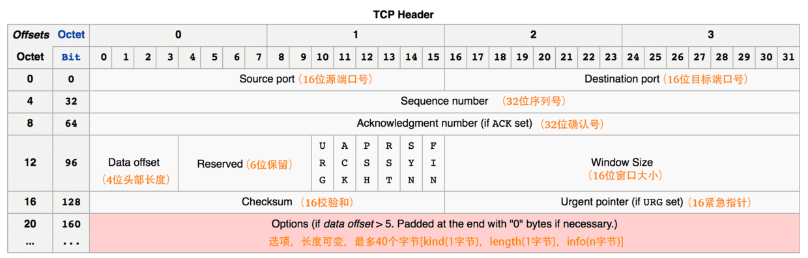
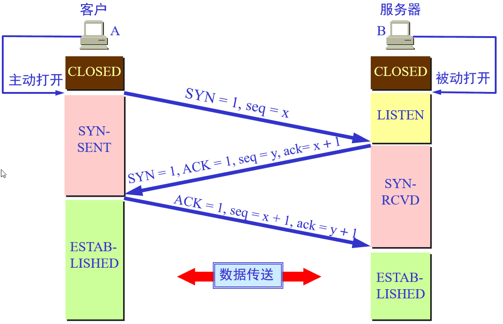
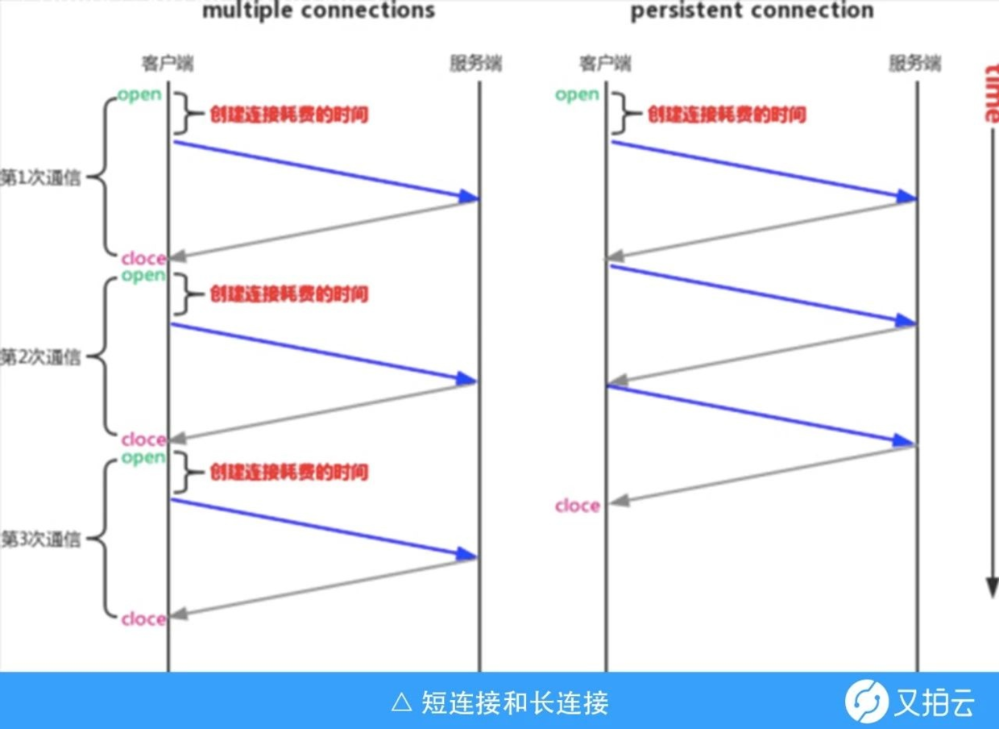
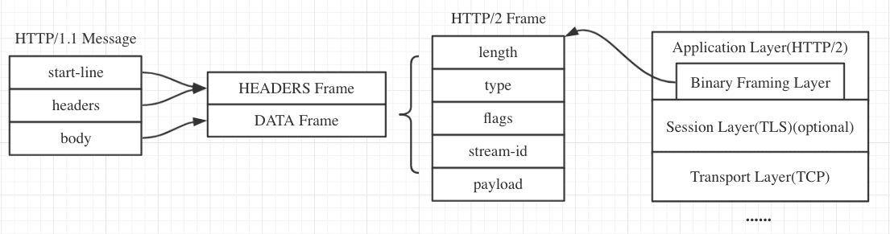
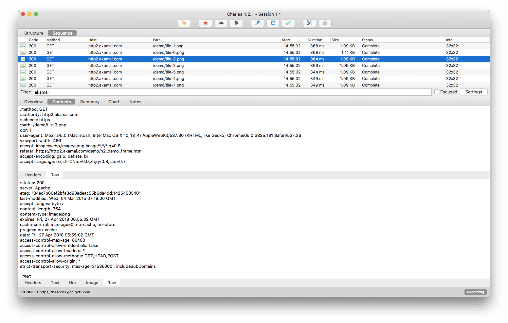
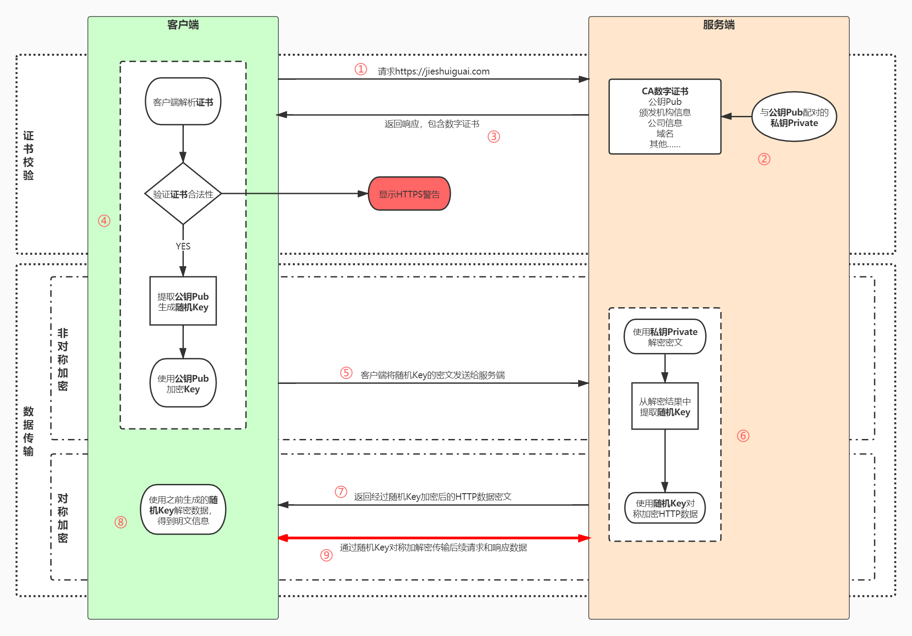

# 互联网协议

## TCP

TCP是一种面向连接的、可靠的、基于字节流的传输层通信协议。

### 报文头部

在建立TCP连接之初，序列号被系统初始化为一个随机值**ISN**（后文例图中为x）。

**一个报文的序列号 = ISN + 该报文携带数据的第一个字节的偏移量**；

**一个报文的确认号 = 发送报文方期待接收到的下一个报文序列号**。

### 三次握手

* 第一次握手

  客户端要向服务端发起连接请求，首先先随机生成一个起始序列号ISN(比如是x)，且发送的报文段SYN标志位置为1。

* 第二次握手

  服务端收到SYN=1报文后，知道这是一个连接请求**（SYN标志位只有在TCP建立连接时才会被置为1）**，于是将客户端的ISN即x存起来，并随机生成服务端的起始序列号y后回复如图所示报文**（ACK=1表示确认号是有效的，携带ACK标志的报文段也称确认报文段）**。

* 第三次握手

  客户端收到回复后发现ACK=1且ack=x+1，于是知道服务端已经收到序列号x的报文，同时发现SYN=1，知道服务端同意了本次连接，便将服务端的序列号y存下来再回复图中所示序列号为x+1的报文。当服务端收到报文后发现ACK=1且ack=y+1，就这样客户端和服务端通过TCP建立了连接。

  **需要注意的是不携带数据的ACK报文是不占据序列号的，所以后面第一次正式发送数据时seq还是x+1)**

### 四次挥手

假设TCP连接成功后客户端共发送了1000个字节数据，服务端在客户端发FIN报文前共回复了2000个字节的数据。

* 第一次挥手

  当客户端的数据传输完成后发送连接释放报文（当然数据没发完时也可以发送），报文包含FIN标志位为1、序列号seq=x+1+1000。需注意客户端发出FIN报文段后只是不能发数据了，但是还可以正常收数据；另外FIN报文段即使不携带数据也要占一个序列号。

* 第二次挥手

  服务端收到FIN报文后以ACK=1，seq=y+2000，ack=x+1+1000+1返回报文， 此时服务端处于关闭等待状态，但不是立马给客户端发FIN报文，因为服务端可能还有数据没发完。

* 第三次握手

  数据传送完毕后，服务端发送FIN报文，如图所示。

* 第四次挥手

  客户端收到FIN报文并回复确认报文，注意发出确认报文后不是立马释放TCP连接，而是要经过2MSL（最长报文段寿命的2倍时长）

### 问答

**为什么TCP连接的时候是3次？2次不可以吗？**

如果只握手2次，如果第二次握手时服务端发给客户端的确认报文段丢失，此时服务端已经准备好了收发数据，而客户端一直没收到确认报文，所以客户端就不知道服务端是否已经准备好了，这种情况下客户端不会给服务端发数据，也会忽略服务端发过来的数据。

**为什么TCP连接的时候是3次，关闭的时候却是4次？**

因为客户端发FIN报文时只能保证客户端没有数据发而不能保证服务端数据发送完毕，因此服务端收到FIN报文后只能先回复一个确认报文，等数据发完了才能回复客户端FIN报文。

**如果已经建立了连接，但是客户端突然出现故障了怎么办？**

TCP设有一个保活计时器，客户端如果出现故障，服务器不能一直白等。服务器每收到一次客户端请求后都会重新复位这个计时器，时间通常是设置为2小时，若两小时还没有收到客户端的任何数据，服务器就会发送一个探测报文段，以后每隔75秒钟发送一次。若一连发送10个探测报文仍然没反应，服务器就认为客户端出了故障，接着就关闭连接。

## HTTP 1.x & 2.0

### HTTP 1.0

HTTP 1.0 默认不支持长连接，其所保持的TCP连接只能处理一个请求，在请求量多的情况下TCP连接数也会增多且容易造成阻塞

### HTTP 1.1

相比于 HTTP 1.0，在一个 TCP 连接上可以传送多个 HTTP 请求和响应，减少了建立和关闭连接的消耗和延迟。在 HTTP 1.1 中默认开启 “Connection: keep-alive”，一定程度上弥补了 HTTP 1.0 每次请求都要创建连接的缺点。如下图所示短连接与长连接区别：

此外还有以下改进等等：

* 所有HTTP 1.1的响应都包含响应头`Date: `用于缓存控制
* 请求头引入了 range 头域以允许只请求资源的某个部分

缺陷：

* 虽能建立在一个TCP连接上完成多个HTTP请求，但在前面的请求未完成前，后续的请求都在排队等待（即线头阻塞）
* Header 内容多，而且每次请求 Header 不会变化太多，没有相应的压缩传输优化方案

### HTTP 2.0

相比HTTP 1.1，不同的变化有：

* 二进制分帧层

  
  
  帧是数据传输的最小单位，以二进制传输代替原本的明文传输，原本的报文消息被划分为更小的数据帧，具体到报文上，相比于HTTP 1.1区别如下两图：
  
  
  
  
  
* 多路复用

  在一个 TCP 连接上，我们可以向对方不断发送帧，每帧的 stream identifier 的标明这一帧属于哪个流，然后在对方接收时，根据 stream identifier 拼接每个流的所有帧组成一整块数据。把 HTTP/1.1 每个请求都当作一个流，那么多个请求变成多个流，请求响应数据分成多个帧，不同流中的帧交错地发送给对方，这就是 HTTP/2 中的多路复用。

更多http2.0内容参见 <a href="https://juejin.cn/post/6844903667569541133" target="_blank">掘金博文</a>。

## HTTPS

可参考 <a href="https://juejin.cn/post/6844903504046211079" target="_blank">文章1</a> 或 <a href="https://juejin.cn/post/6844903599303032845" target="_blank">文章2</a>。

