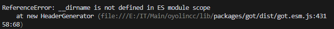
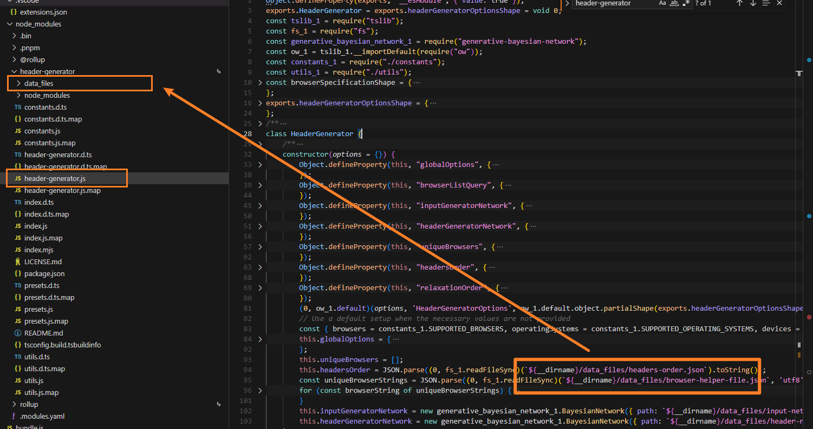
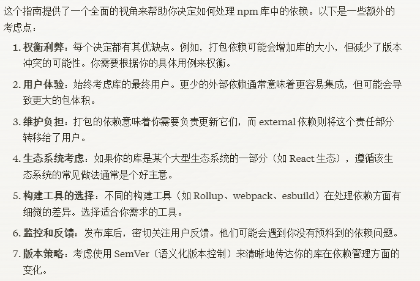

# rollup踩坑记录

近期使用rollup打包，坑从头踩到尾，记录一下。

## mjs和cjs

正常情况下，一个`mjs`文件import一个`cjs`文件在node运行时中是没问题的。**但是经过打包为`esm`时**，由于要合到一个文件里面，就会出现各种各样的问题。

场景：自己开发一些小库，依赖到第三方库，各种esm/cjs混杂...

1. 引入解析问题

rollup默认是esm文件的打包，遇到cjs文件会不知道怎么转换。需要装`@rollup/plugin-commonjs`插件。

2. __dirname

搞了个例子：

```js
// 入口index.mjs
import cm from './commonjs.cjs'

console.log(cm)
```

```js
// 依赖commonjs.cjs
module.exports = {
  dir: __dirname,
  description: 'A commonjs module',
}
```

直接运行因为是运行时，执行是没问题的：

```shell
node index.mjs
```

但是打包成esm后如下：

```js
function getDefaultExportFromCjs (x) {
	return x && x.__esModule && Object.prototype.hasOwnProperty.call(x, 'default') ? x['default'] : x;
}

var commonjs;
var hasRequiredCommonjs;

function requireCommonjs () {
	if (hasRequiredCommonjs) return commonjs;
	hasRequiredCommonjs = 1;
	commonjs = {
	  name: 'commonjs',
	  version: '1.0.0',
	  dir: __dirname,
	  description: 'A commonjs module',
	  main: 'index.js',
	  scripts: {
	    start: 'node index.js'
	  }
	};
	return commonjs;
}

var commonjsExports = requireCommonjs();
var cm = /*@__PURE__*/getDefaultExportFromCjs(commonjsExports);

console.log(cm);
```

注意！`mjs`中是没有`__dirname`的，执行就会报错：



尤其是在大一点的项目中，执行报这个错第一次遇到真是懵逼。后来各种google尝试了许多解决办法，比如`@rollup/plugin-esm-shim`，不过后来发现有bug，不知道为什么。

再后来再深入想了一下，`__dirname`这种东西，在node中是运行时的概念，哪怕是写了个插件polyfill了，但是polyfill的路径也会是错的！因为路径是根据当时开发者开发的文件和他关注的文件来决定的，打包后路径就变了。

举个例子，`header-generator`这个库代码：



跟它包里面的文件夹是强绑定的，把这个库打包进自己的库不太现实，编译过程很难去做`__dirname`的替换。进而有思考到 “什么时候才需要把外部代码打包进自己的库呢？”



我自己的理解就是，如果是node的库，也不涉及浏览器端，跟请求次数就没啥关系了，如果不是极小的包，能`external`就`external`。
