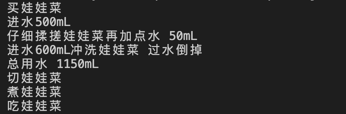
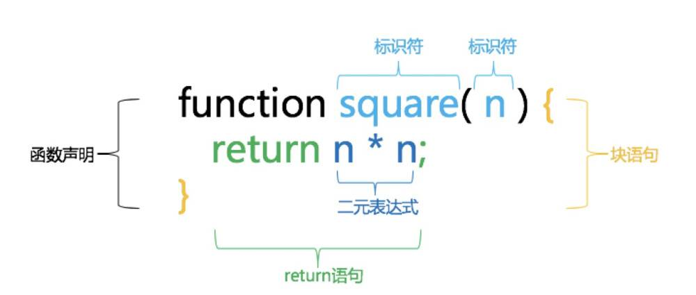
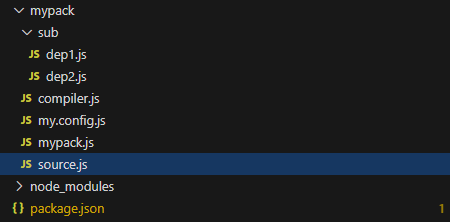
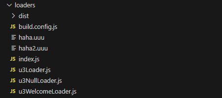
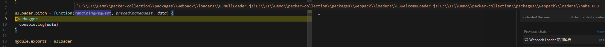
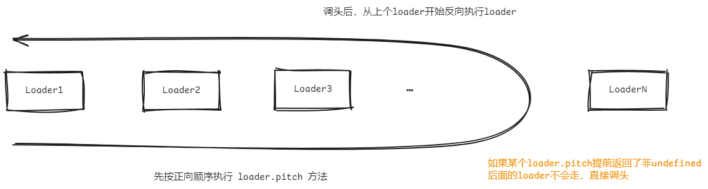

# Webpack原理 4&5

## Webpack 4 运作原理（已过时）

### Tapable事件机制

提起webpack工作机制不得不提tapable，它是wabpack内部衍生出来的库，负责一系列监听函数的调度。可以理解为在发布- 订阅模式基础上针对特定的场景进行了增强。可参见<a href="https://github.com/webpack/tapable" target="_blank">github仓库</a>。

可以通过tap/tapAsync/tapPromise方法在不同钩子上注册监听函数，再用call/callAsync/callPromise调用，例：

```js
const hook = new SyncHook(['info'])
hook.tap('event1', (info) => console.log('event1: ' + info))
hook.call('haha') // event1: haha
```

在tapable中一共有如下的Hook：

| Hook名称                 | 执行方式 | 执行特点                                                     |
| ------------------------ | -------- | ------------------------------------------------------------ |
| SyncHook                 | 同步串行 | 不关心监听函数的返回值                                       |
| SyncBailHook             | 同步串行 | 只要监听函数中有一个函数的返回值不为 undefined，则跳过剩下所有的逻辑 |
| SyncWaterfallHook        | 同步串行 | 上一个监听函数的返回值将作为参数传给下一个监听函数           |
| SyncLoopHook             | 同步循环 | 当监听函数被触发时，如果该监听函数返回类true值则这个监听函数会反复执行，否则表示退出循环 |
| AsyncParallelHook        | 异步并发 | 不关心callback的传值                                         |
| AsyncParallelBailHook    | 异步并发 | 只要callback中有一个传值为类真值，则直接跳到callAsync绑定的回调函数并等正在执行的监听函数全部执行完毕后执行 |
| AsyncSeriesHook          | 异步串行 | 不关心callback的传值                                         |
| AsyncSeriesBailHook      | 异步串行 | 只要callback中有一个传值为类真值，就会跳到callAsync绑定的回调函数执行 |
| AsyncSeriesWaterfallHook | 异步串行 | 上一个监听函数的callback传值会作为下一个监听函数的参数       |
| AsyncSeriesLoopHook      | 异步循环 | 类似SyncLoopHook                                             |

通过阅读源码可知，所有Hook类都继承自基类Hook，且其中tap方法实际上是调用了内部_insert方法注册事件，且tap的option实际上可以是一个对象：

```js
hook.tap('ev', () => {}) 
// 以上写法将转换为
hook.tap({ name: 'ev' }, () => {}) 

/*
且接受before和stage字段：
before：代表本次监听回调执行顺序将在name为该值的回调之前就近的且满足stage规律的位置；
stage：倘若存在stage字段(默认视为0), 则小的stage会在大stage前面，相等的stage后来的在前面。
*/
hook.tap({ name: 'ev2', before: 'ev', stage: 100 }, () => {}) 
```


通过tapable，可以将复杂的任务拆分成一个个小事件调用。比如以下例子：

```js
const { SyncHook, SyncWaterfallHook } = require('tapable')
/**
 * 做菜
 *   买菜
 *   洗菜
 *    洗第一遍
 *    洗第二遍
 *   切菜
 *   煮菜
 * 吃菜
 */
function takeFood(food) {
  const hooks = {
    makeFood: new SyncHook(['food']),
    eatFood: new SyncHook(['food'])
  }
  
  hooks.makeFood.tap('buy', (food) => console.log('买' + food))
  hooks.makeFood.tap('wash', (food) => {
    const washHooks = {
      first: new SyncWaterfallHook(['food', 'waterConsumption']),
      second: new SyncWaterfallHook(['food', 'waterConsumption'])
    }
    washHooks.first.tap('getWater', () => {
      console.log('进水500mL')
      return 500
    })
    washHooks.first.tap('wash', (consumption) => {
      console.log('仔细揉搓' + food + '再加点水 50mL')
      return consumption + 50
    })
    washHooks.second.tap('getWater', () => {
      console.log('进水600mL冲洗' + food + ' 过水倒掉')
      return 600
    })
    const firstConsumption = washHooks.first.call(food)
    const secondConsumption = washHooks.second.call(food)
    console.log('总用水 ' + (firstConsumption + secondConsumption) + 'mL')
  })
  hooks.makeFood.tap('cut', (food) => console.log('切' + food))
  hooks.makeFood.tap('cook', (food) => console.log('煮' + food))
  
  hooks.eatFood.tap('eat', (food) => console.log('吃' + food))

  hooks.makeFood.call(food)
  hooks.eatFood.call(food)
}

takeFood('娃娃菜')
```

执行结果：



现要完成做菜、吃菜两个任务，而做菜可继续细分成若干步骤，通过tap的回调中执行子tap方法完成整个任务链。而webpack的打包流程也不外乎如此，只不过更复杂。

### 抽象语法树

抽象语法树（Abstract Syntax Tree）简称 AST，执行流程可见下图：


1. 图中code先经过parse转换成一个树状数据结构
2. 接着对树中节点进行转换，图中将叶子节点对换位置
3. 将树状结构通过generate再生成code

诸如语法检查、代码错误提示、自动补全甚至代码混淆压缩、改变代码结构等功能都能依靠AST实现。我们每天用到的babel、webpack、eslint、TypeScript背后都需要一套对应的js解析器。

获得抽象语法树的过程为：代码 => 词法分析 => 语法分析 => AST
 `词法分析`：把字符串形式的代码转换为令牌（tokens）流。
 `语法分析`：把一个令牌流转换成 AST 的形式。这个阶段会使用令牌中的信息把它们转换成一个 AST 的表述结构，这样更易于后续的操作。
 如下图，代码为一个简单的函数声明。词法分析阶段，将代码作为字符串输入获得关键词，图中`function`、`square`、`(`、`)`、`{`、`}`等都被识别为关键词。语法分析阶段，对关键词的组合形成一个个节点，如n*n这3个关键词组合成`二元表达式`，关键词return与二元表达式组合成`return语句`。最后组合成一个`函数声明语句`。



其可以被表示为如下JS结构：

```js
{
  type: "FunctionDeclaration",
  id: {
    type: "Identifier",
    name: "square"
  },
  params: [{
    type: "Identifier",
    name: "n"
  }],
  body: {
    type: "BlockStatement",
    body: [{
      type: "ReturnStatement",
      argument: {
        type: "BinaryExpression",
        operator: "*",
        left: {
          type: "Identifier",
          name: "n"
        },
        right: {
          type: "Identifier",
          name: "n"
        }
      }
    }]
  }
}
```

你会留意到AST的每一层都拥有相同的结构，具体见下文。

#### 常见解析器

在v8引擎之前，最早js引擎是SpiderMonkey。js引擎在执行js文件时，都会先将js代码转换成抽象语法树(AST)。有一天，一位Mozilla工程师在FireFox中公开了这个将代码转成AST的解析器Api，后来被人整理到github项目<a href="https://github.com/estree/estree" target="_blank">ESTree</a>，慢慢的成了业界的规范。现在所有的js解析器或编译器基本上都绕不开它，以下是市面上常见解析器：

* **uglify-js**

  用于混淆和压缩代码，由于一些原因，uglify-js自己内部实现了一套AST规范，也正因为它的AST是自创的，不是标准的ESTree，ES6以后新语法的AST都不支持，所以没有办法压缩最新的ES6的代码，如果需要压缩，可以用类似babel这样的工具先转换成ES5。

  > uglify-js可以通过--acorn或者--spidermonkey指定对应的parsing
  
* **esprima**

  这是**第一个用JavaScript编写的符合ESTree规范**的JavaScript的解析器，后续多个编译器都是受它的影响。

* **acorn**

  acorn性能较快，和esprima很类似，输出的AST都是符合ESTree规范的，是目前webpack的AST解析器，和esprima一样不直接支持JSX。

* **@babel/parser(babylon)**

  babel官方的解析器，最初fork于acorn，后来完全走向了自己的道路，从babylon改名之后，其构建的插件体系非常强大。

* **espree**

  eslint、prettier的默认解析器，最初fork于esprima的一个分支（v1.2.2），后来因为ES6的快速发展，但esprima短时间内又不支持，后面就基于acorn开发了。

解析器均参考自文章：<a href="https://zhuanlan.zhihu.com/p/339555291" target="_blank">常见parser</a>。

#### AST规范

参见<a href="https://juejin.cn/post/6844903798347939853" target="_blank">高级前端基础-JavaScript抽象语法树AST</a>

#### 操作AST

AST应用的三个要点：

* 需要一个解析器，将代码转换为AST
* 需要一个遍历器，能够遍历AST,并能够方便的对AST节点进行增删改查等操作
* 需要一个代码生成器，能够将AST转换为代码

常用满足上述的工具一个是`esprima`，一个是`babel`：

esprima的使用：

```js
const esprima = require('esprima');   // code => ast
const estraverse = require('estraverse'); //ast遍历
const escodegen = require('escodegen'); // ast => code
let code = 'const a = 1';
const ast = esprima.parseScript(code);
estraverse.traverse(ast, {
    enter: function (node) {
        //节点操作
    }
});
const transformCode = escodegen.generate(ast);
```

babel的使用：

```js
const parser = require('@babel/parser');  //code => ast
const traverse = require('@babel/traverse').default; // ast遍历，节点增删改查，作用域处理等
const generate = require('@babel/generator').default; // ast => code
const t = require('@babel/types'); // 用于AST节点的Lodash式工具库,各节点构造、验证等
let code = 'const a = 1';
let ast = parser.parse(sourceCode);
traverse(ast, {
  enter (path) { 
    //节点操作
  }
})
const transformCode = escodegen.generate(ast);
```

目前babel不管是从生态上还是文档上比esprima要好很多。

### Webpack 4 构建流程

webpack除了可以用命令行启动外，也支持Node API方式开启构建编译：

```js
const webpack = require('webpack')
const options = require('./webpack.config.js')

webpack(options, (err ,stats) => {
  if (err || stats.hasErrors()) {
    // 在这里处理错误
    return
  }
  console.log('DONE')
})
```

以下是webpack的源码及所做的重要流程：


再来看看compiler，它有个重要的属性hooks，里面存了许多遵循tapable机制的hook，用于像上例中做菜吃菜般的调用。

```js
class Compiler {
    constructor(context){
    // 所有钩子都是由`Tapable`提供的，不同钩子类型在触发时，调用时序也不同
    this.hooks = {
            beforeRun: new AsyncSeriesHook(["compiler"]),
            run: new AsyncSeriesHook(["compiler"]),
            done: new AsyncSeriesHook(["stats"]),
            // ...
        }
    }

    // ...
	
    run(callback){
        const onCompiled = (err, compilation) => {
            if(err) return
            const stats = new Stats(compilation);
            this.hooks.done.callAsync(stats, err => {
                if(err) return
                callback(err, stats)
                this.hooks.afterDone.call(stats)
            })
        }
        this.hooks.beforeRun.callAsync(this, err => {
            if(err) return
            this.hooks.run.callAsync(this, err => {
                if(err) return
                this.compile(onCompiled)
            })
        })
    }
    compile(callback){
      const params = this.newCompilationParams()  // 初始化模块工厂对象
      this.hooks.beforeCompile.callAsync(params, err => {
          this.hooks.compile.call(params)
          // compilation记录本次编译作业的环境信息 
          const compilation = new Compilation(this)
          this.hooks.make.callAsync(compilation, err => {
              compilation.finish(err => {
                  compilation.seal(err=>{
                      this.hooks.afterCompile.callAsync(compilation, err => {
                          return callback(null, compilation)
                      })
                  })
              })
          })
        })
    }
}
```

在run函数中出现的compiler钩子有`beforeRun` --> `run` --> `done` --> `afterDone`，compile函数中出现的钩子有`beforeCompile` --> `compile` --> `make` --> `afterCompile`。即整体流程中重要的钩子为：

| hook                       | 备注                                         |
| -------------------------- | -------------------------------------------- |
| before-run                 | 清除缓存                                     |
| run                        | 注册缓存数据钩子                             |
| before-compile             | -                                            |
| compile                    | 开始编译                                     |
| make                       | 从入口分析依赖以及间接依赖模块，创建模块对象 |
| build-module (compilation) | 模块构建                                     |
| seal (compilation)         | 构建结果封装，不可再更改                     |
| after-compile              | 完成构建，缓存数据                           |
| emit                       | 输出到dist目录                               |

其中build-module和seal为compilation上的hook。

> compiler & compilation 区别
>
> compiler代表的是不变的webpack环境；
> compilation代表的是一次编译作业，每一次的编译都可能不同；
> 举个栗子🌰：
> compiler就像一条手机生产流水线，通上电后它就可以开始工作，等待生产手机的指令；
> compliation就像是生产一部手机，生产的过程基本一致，但生产的手机可能是小米手机也可能是魅族手机。物料不同，产出也不同。

整个过程中涉及抽象语法树的生成、转换、编译：


### 迷你Webpack的实现

解析模块函数（读取某文件并转换为es5代码，并返回该模块的依赖信息）：

```js
let moduleId = 0
function getModuleInfo(filename) {
  const content = fs.readFileSync(filename).toString()
  const ast = parser.parse(content, {
    sourceType: 'module'
  })
  const deps = []

  traverse(ast, {
    ImportDeclaration({ node }) {
      deps.push(node.source.value)
    }
  })

  const { code } = transformFromAst(ast, null, {
    presets: ['@babel/preset-env']
  })

  return {
    filename,
    deps,
    moduleId: moduleId++,
    code
  }
}
```

创建依赖图（基于解析模块函数上，根据入口解析出程序依赖的所有模块，并创建映射）：

```js
function createGraph(entry) {
  const entryModule = getModuleInfo(entry)
  const modules = [entryModule]
  for (let i = 0; i < modules.length; i++) {
    const module = modules[i]
    module.mapping = {}
    module.deps.forEach(relativePath => {
      const subModule = getModuleInfo(path.resolve(path.dirname(module.filename), relativePath))
      module.mapping[relativePath] = subModule.moduleId
      modules.push(subModule)
    })
  }
  return modules
}
```

创建打包文件：

```js
function bundle(graph) {
  let modules = ''
  graph.forEach(module => {
    modules += `
      ${module.moduleId}: [
        function (require, module, exports){
          ${module.code}
        },
        ${JSON.stringify(module.mapping)}
      ],
    `
  })

  return `
    (function(modules){
      function require(id){
        const [fn, mapping] = modules[id];
        function localRequire(relativePath){
          return require(mapping[relativePath]);
        }

        const module = {
          exports: {}
        }

        fn(localRequire, module, module.exports);

        return module.exports;
      }
      require(0);
    })({${modules}})
  `
}
// 写入文件
fs.writeFileSync(
  path.resolve(__dirname, 'dist/bundle.js'),
  Buffer.from(bundle(graph))
)
```


## Webpack 5

本以为有很大差别，其实大体上跟上面差不多。上面的图已经把流程解释的很清楚了。

整个webpack构建流程就是先创建compiler（编译器），每次编译会创建compilation（编译作业），过程中还可能创建子编译器，然后执行编译。

如果是watch模式，每次改动重新编译就是新的compilation。

`Compiler`和`Compilation`就是俩巨大的Tapable实例。各种钩子调来调去，new Compiler的时候会先把很多内部插件钩子注册上去，其中就包括入口插件。

在`make`触发的时候，开始从入口源头进行抽象语法树转换，形成模块依赖对象，然后再构建依赖图，最后生成总代码。

### 另一版迷你webpack

这个是后来写的另一版迷你webpack供参考，首先目录结构：



```js [mypack/my.config.js]
const { resolve } = require('path')

module.exports = {
  entry: resolve(__dirname, './source.js'),
  output: resolve(__dirname, 'bundle.js')
}
```

```js [mypack/sub/dep1.js]
const { add } = require('./dep2.js')

module.exports = {
  log: (a, b) => {
    console.log(add(a, b))
  }
}
```

```js [mypack/sub/dep2.js]
module.exports = {
  add: (a, b) => a + b,
  minus: (a, b) => a - b
}
```

然后是入口文件：

```js [mypack/source.js]
const { log } = require('./sub/dep1.js')
const { minus } = require('./sub/dep2.js')

log(1, 2)
console.log('789 - 456 = ', minus(789, 456))
```

然后是模拟的webpack，执行通过pkg.json的命令执行：

```shell
node mypack/mypack.js -c mypack/my.config.js
```

```js [mypack/mypack.js]
const { parseArgs } = require('node:util')
const { resolve } = require('node:path')
const { existsSync } = require('node:fs')
const { Compiler } = require('./compiler')

const { values } = parseArgs({
  options: {
    config: {
      type: 'string',
      short: 'c',
      default: 'webpack.config.js'
    }
  },
  allowPositionals: false
})

const configPath = resolve(process.cwd(), values.config)

if (!existsSync(configPath)) {
  console.error(`Config file not found: ${configPath}`)
  process.exit(1)
}

function build(config) {
  // new 编译器
  const compiler = new Compiler(config)
  // 编译器执行
  compiler.run()
}

build(require(configPath))
```

compiler.js下有`EntryPlugin`、`Compiler`、`Compilation`。

```js [mypack/compiler.js]
const { AsyncSeriesHook, AsyncParallelHook } = require('tapable')
const fs = require('node:fs')
const { resolve, dirname } = require('node:path')
const { parse } = require('@babel/parser')
const { transformFromAst } = require('@babel/core')
const traverse = require('@babel/traverse').default

/**
 * 入口插件
 */
class EntryPlugin {
  constructor(opts) {
    this.entry = opts.entry
  }

  apply(compiler) {
    compiler.hooks.make.tapAsync('EntryPlugin', (compilation, callback) => {
      try {
        const modules = []
        const visited = new Set()
        modules.push(compilation.buildModule(this.entry))
        visited.add(this.entry)
        for (const module of modules) {
          const subDeps = module.dependencies
          subDeps.length && subDeps.forEach(dep => {
            if (!visited.has(dep)) {
              modules.push(compilation.buildModule(dep))
              visited.add(dep)
            }
          })
        }
        this.graph = modules
        callback()
      } catch (err) {
        callback(err)
      }
    })
  }
}

/**
 * 迷你编译过程
 */
class Compilation {
  constructor() {
    this.hooks = {
      buildModule: new AsyncSeriesHook(['module']),
    }
    this.graph = []
    this.nextModuleId = 0
  }

  buildModule(path) {
    const content = fs.readFileSync(path, 'utf-8')
    const ast = parse(content, { sourceType: 'module' })
    const dependencies = []
    traverse(ast, {
      ImportDeclaration({ node }) {
        dependencies.push(node.source.value)
      },
      CallExpression({ node }) {
        if (node.callee.name === 'require') {
          dependencies.push(resolve(dirname(path), node.arguments[0].value))
        }
      }
    })
    const { code } = transformFromAst(ast, null, {
      presets: ['@babel/preset-env']
    })
    return {
      path,
      content: code,
      dependencies,
      id: this.nextModuleId++,
    }
  }
}

/**
 * 迷你编译器
 */
class Compiler {
  constructor(config) {
    const { entry, output } = config
    this.entry = resolve(process.cwd(), entry)
    this.output = resolve(process.cwd(), output)
    // 定义钩子
    this.hooks = {
			run: new AsyncSeriesHook(["compiler"]),
			make: new AsyncParallelHook(["compilation"]),
    }
    // 内置插件钩子设定，例如入口插件
    new EntryPlugin({
      entry: this.entry,
    }).apply(this)
    // ...
  }

  run() {
    const compilation = new Compilation()
    this.hooks.run.callAsync(this, err => {
      console.log('run end')
      this.hooks.make.callAsync(compilation, err => {
        console.log('make end')
        if (err) {
          console.log(err)
        } else {
          this.bundle()
        }
      })
    })
  }

  bundle() {
    // const { graph } = compilation
    // 累了写不动了，反正更上面那个例子的bundle差不多就行
  }
}

module.exports = {
  Compiler
}
```

### 自定义Loader运作例子



```js [loaders/build.config.js]
const { resolve } = require('path')

module.exports = {
  mode: 'development',
  entry: resolve(__dirname, './index.js'),
  module: {
    rules: [
      {
        test: /.uuu$/,
        use: [
          { loader: 'u3Loader.js' },
          { loader: 'u3NullLoader.js' },
          { loader: 'u3WelcomeLoader.js' }
        ]
      }
    ]
  },
  resolveLoader: {
    modules: ['node_modules', __dirname],
  },
  output: {
    clean: true,
    path: resolve(__dirname, 'dist'),
    filename: '[name].js'
  }
}
```

```js [loaders/u3Loader.js]
function u3Loader(content, sourceMap, meta) {
  const lines = content.split(/\r?\n/)
  debugger
  this.callback(null, 'export default console.log(\'uu\')')
}

u3Loader.pitch = function(remainingRequest, precedingRequest, data) {
  debugger
  console.log(data)
}

module.exports = u3Loader
```

```js [loaders/u3NullLoader.js]
function u3NullLoader(content, sourceMap, meta) {
  const lines = content.split(/\r?\n/)
  debugger
  this.callback(null, content)
}

u3NullLoader.pitch = function(remainingRequest, precedingRequest, data) {
  debugger
  console.log(data)
}

module.exports = u3NullLoader
```

```js [loaders/u3WelcomeLoader.js] 
function u3WelcomeLoader(content, sourceMap, meta) {
  debugger
  this.callback(null, '> WELCOME U3\n' + content, sourceMap, 666)
}

u3WelcomeLoader.pitch = function(remainingRequest, precedingRequest, data) {
  debugger
  // return `import s from ${JSON.stringify(
  //   `-!${remainingRequest}`
  // )}; export default s`
}

module.exports = u3WelcomeLoader
```

```js [loaders/index.js]
// import text from '!./u3Loader!./haha.uuu'
import text from './haha.uuu'

console.log(text)
```



remainingRequest就是剩下的loader的路径，precedingRequest就是前面的loader的路径。执行顺序：




### 插件运作例子

上面迷你webpack中，`EntryPlugin`就是插件，插件通过apply注册个钩子就行。
