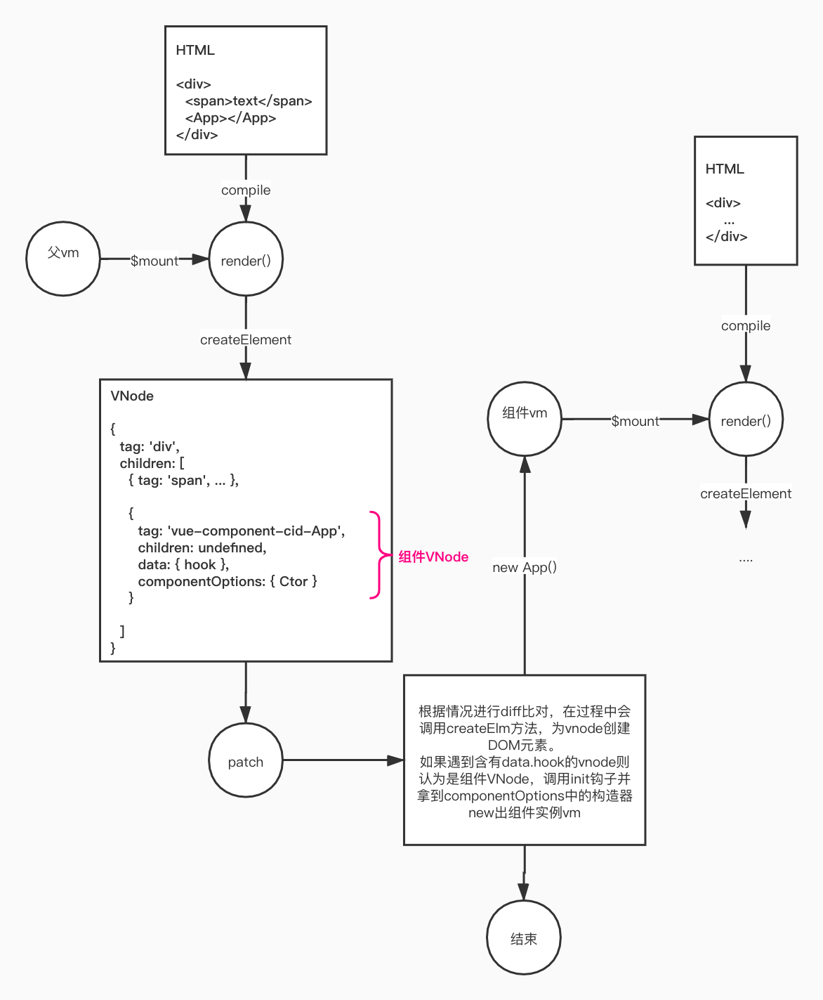

# VUE2 源码分析

## 执行流程概览

Vue总体执行流程可概括为： 

* **初始化原型**

  在`/src/core/instance/index.js`中可见如下代码：

  ```js
  /* 省略import */
  // 定义基类构造器
  function Vue (options) {
    /* ... */
    this._init(options)
  }
  
  /* 定义方便实例调用的原型方法 */
  initMixin(Vue) // 定义_init等方法
  stateMixin(Vue) // 定义$set, $delete, $watch等方法
  eventsMixin(Vue) // 定义$on, $once, $off, $emit等方法
  lifecycleMixin(Vue) // 定义_update, $forceUpdate, $destroy等方法
  renderMixin(Vue) // 定义$nextTick, _render等方法
  
  export default Vue
  ```

* **挂载静态方法**

  在`/src/core/index.js`中可见如下代码：

  ```js
  import Vue from './instance/index'
  import { initGlobalAPI } from './global-api/index'
  /* ... */
  
  /*
  挂载Vue.extend，Vue.components，Vue.mixin等构造器静态方法
  Vue.options也在其中定义，默认是
  {
    component: {},
    directive: {},
    filter: {}
  }
  */
  initGlobalAPI(Vue)
  
  /* ... */
  export default Vue
  ```

* **挂载原型$mount方法（compiler或runtime-only版本）**

  对于runtime-only版本，可在`/src/platforms/web/runtime/index.js`下看见如下代码：

  ```js
  import Vue from 'core/index'
  import { mountComponent } from 'core/instance/lifecycle'
  
  /* ... */
  Vue.prototype.$mount = function (
    el?: string | Element,
    hydrating?: boolean
  ): Component {
    el = el && inBrowser ? query(el) : undefined
    return mountComponent(this, el, hydrating)
  }
  /* ... */
  ```

  而在compiler版本的vue中会做以下操作：

  ```js
  import Vue from './runtime/index' // 获取runtime-only版的Vue
  
  const mount = Vue.prototype.$mount // 拿到runtime-only版$mount
  // 改写方法
  Vue.prototype.$mount = function (
    el?: string | Element,
    hydrating?: boolean
  ): Component {
    /*
    	做许多编译相关的操作
    */
    return mount.call(this, el, hydrating) // 编译后复用runtime-only的$mount
  }
  ```

  可以看到，仅仅是在runtime-only版本基础上多包装了一层。

* **实例化**

  在new Vue过程中调用上文提到的构造函数内的`_init`方法初始化实例：

  ```js
  /* /src/core/instance/init.js */
  let uid = 0
  export function initMixin (Vue: Class<Component>) {
    Vue.prototype._init = function (options?: Object) {
      const vm: Component = this
      vm._uid = uid++ // uid自增
  
      /* ... */
  
      // 合并配置到实例的$options属性
      if (options && options._isComponent) {
        // 如果当前初始化的是组件实例
        initInternalComponent(vm, options)
      } else {
        // 如果当前初始化的是基类实例（即new Vue）
        vm.$options = mergeOptions(
          resolveConstructorOptions(vm.constructor),
          options || {},
          vm
        )
      }
  
      // 初始化渲染代理，用于作为options中传入的render方法的上下文
      if (process.env.NODE_ENV !== 'production') {
        initProxy(vm) // 非生产环境下是一个proxy，用于警告提示等
      } else {
        vm._renderProxy = vm // 生产环境下代理就是vm
      }
      
      // 以下为实例vm初始化很多对应相关的属性
      vm._self = vm
      initLifecycle(vm)
      initEvents(vm)
      initRender(vm)
      callHook(vm, 'beforeCreate')
      initInjections(vm)
      initState(vm) // 按顺序初始化props, methods, data及一些响应式处理
      initProvide(vm)
      callHook(vm, 'created')
  
      /* ... */
  
      if (vm.$options.el) {
        // options中没有传el，则不调用$mount，需手动调用vm.$mount(el)
        vm.$mount(vm.$options.el) // 开始整个的挂载与渲染逻辑
      }
    }
  }
  ```


## 组件与配置

由上文可知在初始化静态方法中定义了Vue.mixin，Vue.options，Vue.extend和Vue.components。

### 配置合并

Vue配置合并**主要**发生在三个地方，一个是Vue.mixin，一个是Vue.extend生成子组件构造器，另一个是初始化实例。

* **Vue.mixin**

  ```js
  Vue.mixin = function (mixin: Object) {
    this.options = mergeOptions(this.options, mixin)
    return this
  }
  ```

  可见Vue.mixin只是把传入的mixin与静态options做合并，合并配置由mergeOptions方法完成：

  ```typescript
  // 默认合并策略
  const defaultStrat = function (parentVal: any, childVal: any): any {
    return childVal === undefined
      ? parentVal
      : childVal
  }
  
  export function mergeOptions (
    parent: Object,
    child: Object,
    vm?: Component
  ): Object {
    /* ... */
    const options = {}
    let key
    for (key in parent) {
      mergeField(key)
    }
    for (key in child) {
      if (!hasOwn(parent, key)) {
        mergeField(key)
      }
    }
    function mergeField (key) {
      // 根据合并策略strat作合并
      const strat = strats[key] || defaultStrat
      options[key] = strat(parent[key], child[key], vm, key)
    }
    return options
  }
  ```

  strats是一个对象，定义了各个属性的合并策略，例如created, data等属性的合并，如果mixin中含有策略中没有的属性，则采取默认策略defaultStrat，即子有值则取子否则取父。

* **Vue.extend**

  ```typescript
  Vue.extend = function (extendOptions: Object): Function {
    extendOptions = extendOptions || {}
    const Super = this
    const SuperId = Super.cid
    
    /* 缓存优化操作 */
    const cachedCtors = extendOptions._Ctor || (extendOptions._Ctor = {})
    if (cachedCtors[SuperId]) {
      return cachedCtors[SuperId]
    }
  
    /* ... */
  
    const Sub = function VueComponent (options) {
      this._init(options)
    }
    /* 原型继承方式定义子组件构造器 */
    Sub.prototype = Object.create(Super.prototype)
    Sub.prototype.constructor = Sub
    Sub.cid = cid++
    /* 合并配置，将父静态options与extendOptions合并 */
    Sub.options = mergeOptions(
      Super.options,
      extendOptions
    )
    Sub['super'] = Super
  
    /* ... */
  
    /* 使子组件构造函数也具备一样的静态方法 */
    Sub.extend = Super.extend
    Sub.mixin = Super.mixin
    Sub.use = Super.use
    ASSET_TYPES.forEach(function (type) {
      Sub[type] = Super[type]
    })
  
    Sub.superOptions = Super.options
    Sub.extendOptions = extendOptions // 保留作副本
    Sub.sealedOptions = extend({}, Sub.options)
  
    /* 缓存优化操作 */
    cachedCtors[SuperId] = Sub
    return Sub
  }
  ```

  可以看到Vue.extend会将Vue.options与extendOptions合并赋给Sub.options，此处的缓存优化是防止多次执行Vue.extend(options)的options是相同的对象，减少不必要的操作。

* **初始化实例**

  在初始化实例时调用`_init`方法会执行如下代码：

  ```typescript
  vm.$options = mergeOptions(
    resolveConstructorOptions(vm.constructor),
    options || {},
    vm
  )
  ```

  resolveConstructorOptions的定义如下：

  ```typescript
  export function resolveConstructorOptions (Ctor: Class<Component>) {
    let options = Ctor.options
    // 如果Ctor是Vue，则没有super，会直接返回Vue.options
    if (Ctor.super) {
      // 获取最新的上层配置
      const superOptions = resolveConstructorOptions(Ctor.super)
      const cachedSuperOptions = Ctor.superOptions
      // 判断配置是否被更改
      if (superOptions !== cachedSuperOptions) {
        Ctor.superOptions = superOptions
        const modifiedOptions = resolveModifiedOptions(Ctor)
        if (modifiedOptions) {
          extend(Ctor.extendOptions, modifiedOptions)
        }
        options = Ctor.options = mergeOptions(superOptions, Ctor.extendOptions)
        if (options.name) {
          options.components[options.name] = Ctor
        }
      }
    }
    return options
  }
  ```

  resolveConstructorOptions主要做的事是返回构造器最新的静态options，如果我们先执行`Vue.extends(options)`，再执行`const Sub = Vue.mixin(options2)`，则此时执行`new Sub()`得到实例的$options会不准确，因为没有把mixin的options2算上去，因此需要多加一层配置是否有变动的判断。

### 组件注册

Vue中使用组件需要先注册，可以调用Vue.components方法完成注册：

```js
ASSET_TYPES.forEach(type => {
  Vue[type] = function (
  id: string,
   definition: Function | Object
  ): Function | Object | void {
    if (!definition) {
      return this.options[type + 's'][id] // 没有第二个参数则是获取
    } else {
    	/* ... */
      if (type === 'component' && isPlainObject(definition)) {
        definition.name = definition.name || id // 优先取name
        definition = this.options._base.extend(definition) // 创建为构造器
      }
    	/* ... */
      this.options[type + 's'][id] = definition
      return definition
    }
  }
})
```

方法内部会把组件构造器存在Vue.options.components中，此为全局注册组件，当某实例访问时，会通过合并配置得以访问到全局组件。局部注册组件的构造器已经在Sub.options.components中。


## $mount全过程

对于compile版本的Vue，$mount方法全过程可概括为：

1. 将template编译成render函数；

2. 定义用于被watcher观测的渲染更新函数updateComponent；

3. new Watcher，触发updateComponent开启渲染流程；

4. vm._render()生成VNode；

   内部通过createElement方法创建VNode，可能是普通DOM VNode也可能是一个组件VNode，详情见下图。

5. vm._update(newVnode)开始patch过程。

总过程可通过下图反映：



**`vm.$vnode`**指向组件vnode，**`vm._vnode`**指向根据组件vnode创建出来的根vnode。


## 编译流程

整个编译涉及三个过程：**模板解析成AST**，**AST树优化**，**AST生成render函数**。

```typescript
export const createCompiler = createCompilerCreator(function baseCompile (
  template: string,
  options: CompilerOptions
): CompiledResult {
  const ast = parse(template.trim(), options) // parse解析
  if (options.optimize !== false) {
    optimize(ast, options) // AST优化
  }
  const code = generate(ast, options) // 生成render函数代码
  return {
    ast,
    render: code.render,
    staticRenderFns: code.staticRenderFns
  }
})
```

### 模板解析成AST

Vue将对模板字符串进行解析，并通过钩子回调的方式在解析到诸如标签开始、标签结束、文本等等的时机触发。通过栈的方式，从父节点的AST节点开始深度遍历，加入到children中，形成AST树。在过程中，对v-if、v-for及事件绑定等信息做解析，并加入到AST节点中。

### AST树优化

优化做的步骤实际上就两步：

1. 用递归的方式将所有节点添加 static 属性，标识是不是静态节点（即 **DOM 不需要发生变化**的节点）；
2. 标记所有静态根节点（即**子节点全是静态节点**的节点）。

需注意的是如果**一个静态节点没有子节点**或**一个根节点只有一个文本节点**，也会被当成是非静态根节点。标记静态节点有两个好处：

1. 每次重新渲染的时候不需要为静态节点创建新节点；
2. 在 Virtual DOM 中 patching 的过程可以被跳过。

### AST生成render函数

以下面为例：

```html
<div>
  <p>{{name}}</p>
</div>
```

则最后生成的render函数代码：

```js
{
  render: `with(this){return _c('div',[_c('p',[_v(_s(name))])])}`
}
```

Vue定义了一系列对渲染便利的方法：

```typescript
export function installRenderHelpers (target: any) {
  target._o = markOnce
  target._n = toNumber
  target._s = toString
  target._l = renderList
  target._t = renderSlot
  target._q = looseEqual
  target._i = looseIndexOf
  target._m = renderStatic
  target._f = resolveFilter
  target._k = checkKeyCodes
  target._b = bindObjectProps
  target._v = createTextVNode
  target._e = createEmptyVNode
  target._u = resolveScopedSlots
  target._g = bindObjectListeners
  target._d = bindDynamicKeys
  target._p = prependModifier
}
```


## 响应式处理细节

### Watcher工作原理

watcher的设计目的是为了观测**一个表达式**或**一个函数**，例如观测某表达式`student.name`或`一个渲染过程（渲染函数）`中所有的依赖，而这个表达式或函数的术语称为**getter**，可以理解为**收集依赖器**。watcher工作流程图如下：


Vue实例在初始化时便会对options中的data或props做响应式处理：

```typescript
export function observe (value: any, asRootData: ?boolean): Observer | void {
  /*
  尝试 new Observer(value)，如果value是对象或数组，则会一层一层遍历下去，
  为每个属性defineReactive，且每层都会有属性 __ob__ 指向 Observer 实例，
  最后把最外层__ob__返回
  如果value已经具有__ob__，说明已经响应式处理过，直接返回
  */
}

export class Observer {
  value: any;
  dep: Dep;
  vmCount: number; // number of vms that have this object as root $data

  constructor (value: any) {
    this.value = value
    this.dep = new Dep()
    this.vmCount = 0
    def(value, '__ob__', this)
    if (Array.isArray(value)) {
      if (hasProto) {
        protoAugment(value, arrayMethods)
      } else {
        copyAugment(value, arrayMethods, arrayKeys)
      }
      this.observeArray(value)
    } else {
      this.walk(value)
    }
  }
  // 遍历obj定义响应式
  walk (obj: Object) {
    const keys = Object.keys(obj)
    for (let i = 0; i < keys.length; i++) {
      defineReactive(obj, keys[i])
    }
  }
  /* ... */
}

export function defineReactive (
  obj: Object,
  key: string,
  val: any,
  customSetter?: ?Function,
  shallow?: boolean
) {
  const dep = new Dep()
  /* ... */
  let childOb = !shallow && observe(val)
  Object.defineProperty(obj, key, {
    enumerable: true,
    configurable: true,
    get: function reactiveGetter () {
      const value = getter ? getter.call(obj) : val
      if (Dep.target) {
        dep.depend()
        // 将下层的__ob__依赖跟当前watcher挂钩
        if (childOb) {
          childOb.dep.depend()
          if (Array.isArray(value)) {
            dependArray(value)
          }
        }
      }
      return value
    },
    set: function reactiveSetter (newVal) {
      const value = getter ? getter.call(obj) : val
      // 只有新旧值不同，才往下执行
      if (newVal === value || (newVal !== newVal && value !== value)) {
        return
      }
      /* ... */
      childOb = !shallow && observe(newVal) // 对新值响应式处理
      dep.notify() // 说明依赖发生变动，通知订阅的watcher
    }
  })
}
```

new Watcher时收集依赖：

```js
/* Watcher */
get () {
  pushTarget(this) // Dep.target指向this
  let value
  const vm = this.vm
  try {
    value = this.getter.call(vm, vm)
  } catch (e) {
    /* ... */
  } finally {
    if (this.deep) {
      traverse(value)
    }
    popTarget() // 重置Dep.target
    this.cleanupDeps() // 比对新旧依赖，清除不需要订阅的旧依赖
  }
  return value
}
/* Dep */
const targetStack = []
export function pushTarget (target: ?Watcher) {
  targetStack.push(target)
  Dep.target = target
}

export function popTarget () {
  targetStack.pop()
  Dep.target = targetStack[targetStack.length - 1]
}
```

比对新旧依赖的cleanupDeps：

```js
cleanupDeps () {
  let i = this.deps.length
  while (i--) {
    const dep = this.deps[i]
    if (!this.newDepIds.has(dep.id)) {
      dep.removeSub(this) // 新依赖中不需要依赖的dep下一次不用通知到本watcher
    }
  }
  // 新依赖保存为旧依赖供下一次比对使用
  let tmp = this.depIds
  this.depIds = this.newDepIds
  this.newDepIds = tmp
  this.newDepIds.clear()
  tmp = this.deps
  this.deps = this.newDeps
  this.newDeps = tmp
  this.newDeps.length = 0
}
```

对于watcher的更新：

```js
/* Watcher中 */
update () {
  /* istanbul ignore else */
  if (this.lazy) {
    this.dirty = true
  } else if (this.sync) {
    this.run()
  } else {
    queueWatcher(this) // 非lazy非同步watcher则加入队列
  }
}

run () {
  if (this.active) {
    const value = this.get()
    // 一些判断，最后在响应情况下执行回调：
    this.cb.call(this.vm, value, oldValue)
  }
}
/* 加入队列 */
export function queueWatcher (watcher: Watcher) {
  const id = watcher.id
  if (has[id] == null) {
    has[id] = true
    if (!flushing) {
      queue.push(watcher)
    } else {
      let i = queue.length - 1
      while (i > index && queue[i].id > watcher.id) {
        i--
      }
      queue.splice(i + 1, 0, watcher)
    }
    if (!waiting) {
      // 保证当前队列只加入一次到nextTick中
      waiting = true

      if (process.env.NODE_ENV !== 'production' && !config.async) {
        flushSchedulerQueue()
        return
      }
      nextTick(flushSchedulerQueue) // 遍历watcher执行run方法
    }
  }
}
```

### 一个例子

```vue
<template>
  <div>
    <span>{{ a.b }}</span>
    <button @click="change">change</button>
  </div>
</template>

<script>
export default {
  data() {
    const payload = { a: { b: 1 } }
    return payload
  },
  methods: {
    change() {
      const payload2 = { b: 2, c: 9 }
      this.a = payload2
    }
  }
}
</script>
```

1. 渲染

   渲染watcher在创建VNode时需要`this.$data.a.b`值触发对象getter收集到依赖`dep1: payload.a`，`dep2: payload.a.__ob__.dep`和`dep3: payload.a.b`；

2. 点击按钮

   触发payload对属性a的setter，将新对象payload2重新响应式处理，之后触发dep1.notify通知watcher更新，在nextTick中执行run方法重新渲染，重新收集到依赖`dep1`，`dep4: payload2.__ob__.dep`和`dep5: payload2.b`。紧接着比对旧依赖`[1, 2, 3]`和`[1, 4, 5]`，发现`dep2`和`dep3`已不再依赖，将其中的subs数组中本watcher移除，下次更改payload.a.b时不用通知渲染watcher。

### 一些思考

* **为什么pushTarget不直接将Dep.target = this？**

  因为可能一个watcher还没有执行完就开始了下一个watcher的pushTartget，例如在渲染过程中，父实例的渲染watcher开启的渲染过程可能先触发子实例的new Watcher，此时需要一个栈作缓存。

* **`__ob__`/childOb.depend()的作用？**

  值得注意的是在定义响应式时对象和数组是不一样的，例如：

  ```js
  const obj = { a: 123 }
  const arr = [{}, {}, {}]
  ```

  在定义对象响应式时是把obj每个键都定义getter和setter，而数组会**无视数字键名**（即0, 1, 2, ...），从各个数组元素开始定义响应式。因此对于以下例子，change1方法是无效的而change2有效。

  ```vue
  <template>
    <span>{{ a[0].m }}</span>
  </template>
  
  <script>
  export default {
    data() { return { a: [{ m: 1 }] } },
    methods: {
      change1() { this.a[0] = { m: 9 } }, // 无效
      change2() { this.a[0].m = 9 }, // 有效
      change3() { this.a.splice(0, 1, { m: 9 }) } // 有效
    }
  }
  </script>
  ```

  change3有效是因为Vue对数组的push, splice等方法进行了重写，当元素产生变动时会触发`this.a.__ob__.dep.notify`使watcher重新渲染。

  以上是数组的情况，而对象对于一些没有定义响应式的键，也不会触发更新，需要借助Vue.set方法（内部会通过拿到对象`__ob__`执行dep.notify）派发更新。因此，对于一个对象obj或数组arr而言，`__ob__`属性可以视为是一个可以代表全局变动的依赖。

  在一些Vue.set/this.$set场景下，定义响应式中的childOb.depend便格外必要。

* **为什么每次数据变动，watcher都要重新收集依赖并进行比对？**

  通常watcher的run时机是异步的，在一系列数据变动后，可能需要依赖的部分也发生了变化。例如：

  ```html
  <span v-if="student.visible">{{ student.name }}</span>
  ```

  在student.visible为true时，渲染watcher将收集到依赖`dep1: student.visible`和`dep2: student.name`，当visible更改为false时，实际上此时只依赖了dep1，当dep2变动时可以不再通知到当前渲染watcher。

* **nextTick的问题**

  Vue.nextTick是借助**微任务（若兼容性差的环境可能降级为宏任务）**执行的异步方法，Vue将遍历watcher数组的过程封装成一个方法`flushSchedulerQueue`加入到nextTick回调队列中，而遍历nextTick回调队列执行的过程又塞在一个微任务中。

  ```vue
  <template>
    <span>{{ message }}</span>
  </template>
  
  <script>
  export default {
    data() { return { message: 'temp1' },
    methods: {
      change1() {
        this.message = 'temp2'
        this.$nextTick(() => console.log(this.message))
      },
      change2() {
        this.$nextTick(() => console.log(this.message))
        this.message = 'temp2'
      }
    }
  }
  </script>
  ```

  看似change2和change1结果是相同的，console.log会在赋值之后执行，然而实际上它们都是在同一个nextTick回调队列中，且console.log先执行。因此会输出`temp1`后输出`temp2`。


## 深入patch过程

### patch入口

 在vm._update过程中执行了\_\_patch\_\_方法：

```typescript
/* _update方法定义 */
Vue.prototype._update = function (vnode: VNode, hydrating?: boolean) {
  const vm: Component = this
  const prevEl = vm.$el
  const prevVnode = vm._vnode
  const restoreActiveInstance = setActiveInstance(vm)
  vm._vnode = vnode

  if (!prevVnode) {
    // 初次渲染
    vm.$el = vm.__patch__(vm.$el, vnode, hydrating, false /* removeOnly */)
  } else {
    // 视图变动更新
    vm.$el = vm.__patch__(prevVnode, vnode)
  }
  /* ... */
}
/* __patch__定义 */
Vue.prototype.__patch__ = inBrowser ? patch : noop
/* patch方法定义 */
export const patch: Function = createPatchFunction({ nodeOps, modules })
/* createPatchFunction定义 */
export function createPatchFunction (backend) {
  let i, j
  const cbs = {}
  const { modules, nodeOps } = backend
	// 根据modules收集钩子回调
  for (i = 0; i < hooks.length; ++i) {
    cbs[hooks[i]] = []
    for (j = 0; j < modules.length; ++j) {
      if (isDef(modules[j][hooks[i]])) {
        cbs[hooks[i]].push(modules[j][hooks[i]])
      }
    }
  }
  /* ... */
  return function patch (oldVnode, vnode, hydrating, removeOnly) {
    /* ... */
  }
}
```

### patch

oldVnode可能是第一次渲染时的`undefined`，也可能是后续更新时的旧vnode。patch函数根据情况调用`patchVnode`或`createElm`方法开启整个patch过程。以下说明 **省略** 文本节点等过于细节的情况处理。

### sameVnode

```js
function sameVnode (a, b) {
  return (
    a.key === b.key &&
    a.asyncFactory === b.asyncFactory && (
      (
        a.tag === b.tag &&
        a.isComment === b.isComment &&
        isDef(a.data) === isDef(b.data) &&
        sameInputType(a, b)
      ) || (
        isTrue(a.isAsyncPlaceholder) &&
        isUndef(b.asyncFactory.error)
      )
    )
  )
}
```

根据一些条件判断两个vnode是否可以看作是有相同意义的vnode，是patch过程是否要进行diff算法比对的关键。若两个vnode被视为相同，则认为两个vnode**值得继续比较**，将做 `patchVnode(oldVnode, newVnode, ...)` 操作；若两个vnode被视为不同，则直接进行DOM替换，省去子vnode的比较，提升效率。

### createElm

```typescript
function createElm (
  vnode,
  insertedVnodeQueue,
  parentElm,
  refElm,
  nested,
  ownerArray,
  index
) {}
```

根据传入的vnode创建DOM，在这过程中，会先判断是否是组件vnode：

* 如果是

  调用`createComponent`方法，根据vnode.componentOptions.Ctor拿到组件构造器并创建实例，触发组件实例的$mount。

* 如果不是

  先创建DOM元素，再调用`createChildren`方法创建DOM的子元素，最后插入到refElm之前。即创建DOM顺序为先父后子，插入顺序为先子后父。

### patchVnode

```typescript
function patchVnode (
  oldVnode,
  vnode,
  insertedVnodeQueue,
  ownerArray,
  index,
  removeOnly
) {}
```

根据oldVnode和vnode情况打补丁，对DOM元素进行删减。会判断oldVnode和vnode的子vnode情况：

* oldVnode存在子而vnode没有子

  说明原子DOM元素应该删除，调用`removeVnodes`删除。

* oldVnode没有子而vnode存在子

  说明应该添加新的子DOM元素，调用`addVnodes`添加（内部会调用`createElm`）。

* oldVnode和vnode都存在子

  说明应该比对新旧子vnode情况，则调用`updateChildren(elm, oldCh, ch, ...)`进行子vnodes的diff算法比对。

### updateChildren & diff

diff算法的基础是同级比较，即两个vnode树中，不会跨级做比较，这样能大大减少算法的复杂度。

```js
function updateChildren (parentElm, oldCh, newCh, insertedVnodeQueue, removeOnly) {
  let oldStartIdx = 0
  let newStartIdx = 0
  let oldEndIdx = oldCh.length - 1
  let oldStartVnode = oldCh[0]
  let oldEndVnode = oldCh[oldEndIdx]
  let newEndIdx = newCh.length - 1
  let newStartVnode = newCh[0]
  let newEndVnode = newCh[newEndIdx]
  let oldKeyToIdx, idxInOld, vnodeToMove, refElm
  /* ... */
  while (oldStartIdx <= oldEndIdx && newStartIdx <= newEndIdx) {
    // 跳过undefined情况，因为后续操作可能出现undefined
    if (isUndef(oldStartVnode)) {
      oldStartVnode = oldCh[++oldStartIdx]
    } else if (isUndef(oldEndVnode)) {
      oldEndVnode = oldCh[--oldEndIdx]
    }
    // 开始依次比较头头、尾尾、头尾、尾头
     else if (sameVnode(oldStartVnode, newStartVnode)) {
      patchVnode(oldStartVnode, newStartVnode, insertedVnodeQueue, newCh, newStartIdx)
      oldStartVnode = oldCh[++oldStartIdx]
      newStartVnode = newCh[++newStartIdx]
    } else if (sameVnode(oldEndVnode, newEndVnode)) {
      patchVnode(oldEndVnode, newEndVnode, insertedVnodeQueue, newCh, newEndIdx)
      oldEndVnode = oldCh[--oldEndIdx]
      newEndVnode = newCh[--newEndIdx]
    } else if (sameVnode(oldStartVnode, newEndVnode)) {
      patchVnode(oldStartVnode, newEndVnode, insertedVnodeQueue, newCh, newEndIdx)
      canMove && nodeOps.insertBefore(parentElm, oldStartVnode.elm, nodeOps.nextSibling(oldEndVnode.elm))
      oldStartVnode = oldCh[++oldStartIdx]
      newEndVnode = newCh[--newEndIdx]
    } else if (sameVnode(oldEndVnode, newStartVnode)) {
      patchVnode(oldEndVnode, newStartVnode, insertedVnodeQueue, newCh, newStartIdx)
      canMove && nodeOps.insertBefore(parentElm, oldEndVnode.elm, oldStartVnode.elm)
      oldEndVnode = oldCh[--oldEndIdx]
      newStartVnode = newCh[++newStartIdx]
    } else {
    // 创建keyMap，看是否新子vnode是否在旧子vnodes里面
      if (isUndef(oldKeyToIdx)) oldKeyToIdx = createKeyToOldIdx(oldCh, oldStartIdx, oldEndIdx)
      idxInOld = isDef(newStartVnode.key)
        ? oldKeyToIdx[newStartVnode.key]
      : findIdxInOld(newStartVnode, oldCh, oldStartIdx, oldEndIdx)
      if (isUndef(idxInOld)) {
        // 不在，说明是全新的vnode，直接创建DOM
        createElm(newStartVnode, insertedVnodeQueue, parentElm, oldStartVnode.elm, false, newCh, newStartIdx)
      } else {
        vnodeToMove = oldCh[idxInOld]
        if (sameVnode(vnodeToMove, newStartVnode)) {
          patchVnode(vnodeToMove, newStartVnode, insertedVnodeQueue, newCh, newStartIdx)
          oldCh[idxInOld] = undefined
          canMove && nodeOps.insertBefore(parentElm, vnodeToMove.elm, oldStartVnode.elm)
        } else {
          createElm(newStartVnode, insertedVnodeQueue, parentElm, oldStartVnode.elm, false, newCh, newStartIdx)
        }
      }
      newStartVnode = newCh[++newStartIdx]
    }
  }
  // 比对完毕，旧children留下来的是多余的，删除，新children留下来的是新的，全部创建DOM
  if (oldStartIdx > oldEndIdx) {
    refElm = isUndef(newCh[newEndIdx + 1]) ? null : newCh[newEndIdx + 1].elm
    addVnodes(parentElm, refElm, newCh, newStartIdx, newEndIdx, insertedVnodeQueue)
  } else if (newStartIdx > newEndIdx) {
    removeVnodes(oldCh, oldStartIdx, oldEndIdx)
  }
}
```


