# Vue@3.5.5 源码分析：构建与渲染系统

**注：本文的分析均基于`vue@3.5.5`版本上叙述。且为了可读性需要，以下展示的源码将省略部分类型及泛型声明、注释等，仅突出主逻辑，若有特殊需要请自行查阅项目工程。**

## 项目总览

项目源码拉取：[Github仓库](https://github.com/vuejs/core)

项目启动与开发指南：[Github贡献指南](https://github.com/vuejs/core/blob/main/.github/contributing.md#development-setup)，可以详细了解到项目的构建、启动、测试、提交等流程。

根据[github原话](https://github.com/vuejs/core/blob/main/.github/contributing.md#project-structure)，仓库采用`pnpm + monorepo`方式搭建，packages 目录下托管了许多相关的代码包：

| 包名            | 描述                                                                                                                                                                                                   |
| --------------- | ------------------------------------------------------------------------------------------------------------------------------------------------------------------------------------------------------ |
| reactivity      | 响应式系统，它可以独立用作与框架无关的软件包。                                                                                                                                                         |
| runtime-core    | 与平台无关的运行时核心。包括用于虚拟 dom 渲染器、组件实现和 JavaScript API 的代码。可以使用此包创建针对特定平台的高阶运行时（即自定义渲染器）。                                                        |
| runtime-dom     | 面向浏览器的运行时。包括对本地 DOM API、attrs、props、事件处理程序等的处理。                                                                                                                           |
| runtime-test    | 用于测试的轻量级运行时。可以在任何 JavaScript 环境中使用，因为它 “渲染” 了一棵纯 JavaScript 对象树。该树可用于断言正确的渲染输出。并提供用于序列化树、触发事件和记录更新期间执行的实际节点操作的工具。 |
| server-renderer | 用于服务器端渲染的包。                                                                                                                                                                                 |
| compiler-core   | 与平台无关的编译器核心。包括编译器的可扩展基础和所有与平台无关的插件。                                                                                                                                 |
| compiler-dom    | 具有专门针对浏览器的附加插件的编译器。                                                                                                                                                                 |
| compiler-sfc    | 用于编译 Vue 单文件组件的底层工具。                                                                                                                                                                    |
| compiler-ssr    | 生成针对服务器端渲染优化的渲染函数的编译器。                                                                                                                                                           |
| shared          | 在多个包之间共享的内部工具（尤其是运行时和编译器包使用的与环境无关的工具）。                                                                                                                           |
| vue             | 面向公众的“完整构建”，包括运行时和编译器。                                                                                                                                                             |

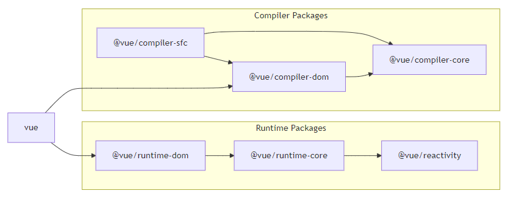

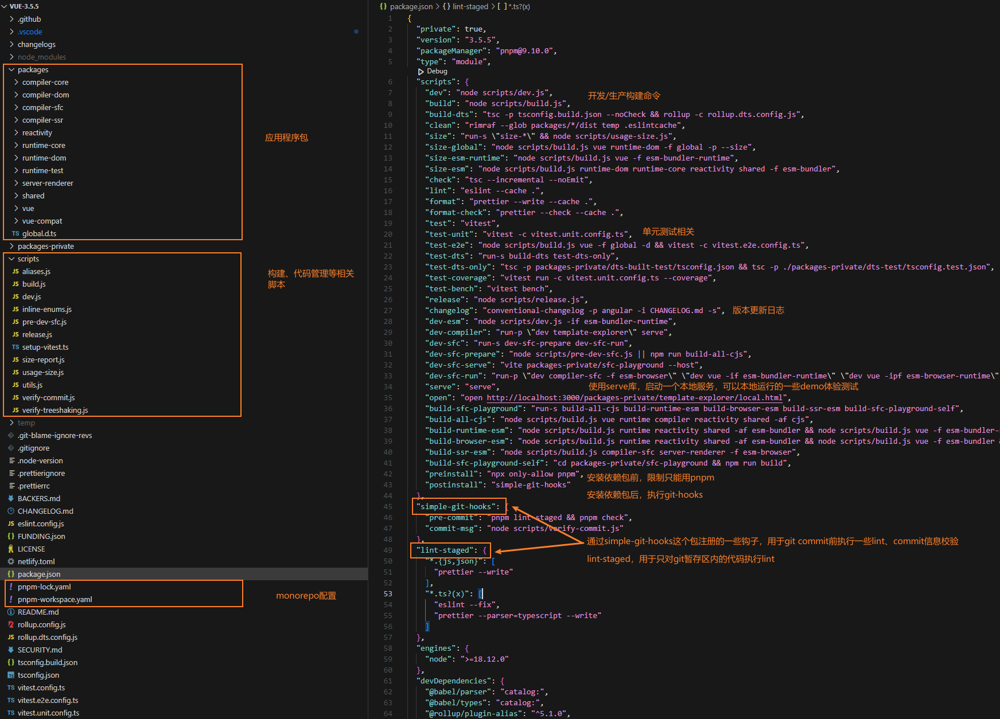

## 构建流程

### 打包格式

项目的构建逻辑很清晰，以`package.json`为入口，执行`dev.js`和`build.js`：
```json
{
  "dev": "node scripts/dev.js",
  "build": "node scripts/build.js",
}
```

通过阅读`dev.js`可知，开发环境打包是用`esbuild`完成，而生产环境打包是用`rollup`。理由是`esbuild`打包速度快，适用于开发环境。`rollup`打包产物更小，更利于tree-shaking。后文将分析`build.js`，忽略`dev.js`。

先来看[github](https://github.com/vuejs/core/blob/main/.github/contributing.md#build-formats)上的构建叙述，每个子包都会通过`package.json`中`buildOptions.formats`字段指定打包成的多种格式：`global`, `esm-bundler`, `esm-browser`, `cjs`，对于主包`vue`还会支持`global-runtime`, `esm-bundler-runtime`, `esm-browser-runtime`。

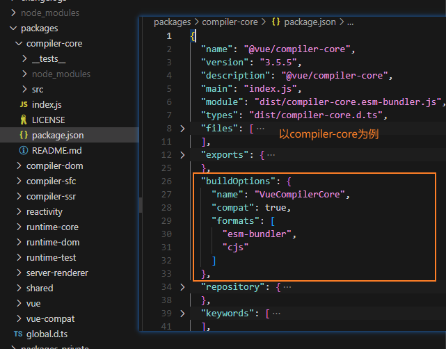

格式种类可参考[什么时候使用哪种格式](https://github.com/vuejs/core/blob/main/packages/vue/README.md#which-dist-file-to-use)，在此不赘述。

### 打包示例

```bash
# 打包 runtime-core 包，格式为 esm-browser 和 cjs
pnpm build runtime-core -f esm-browser,cjs
# 打包匹配到 runtime 和 compiler 字样的<所有包>（因为指定了--all），并打包ts类型文件（因为指定了-t）
pnpm build runtime compiler -t -all
```

打包脚本的调试，VSCode配置以下再打断点即可：
```json
{
  "version": "0.2.0",
  "configurations": [
    {
      "type": "node",
      "request": "launch",
      "name": "Build Vue",
      "skipFiles": ["<node_internals>/**"],
      "program": "pnpm build runtime compiler -t -all"
    }
  ]
}
```

### 打包逻辑

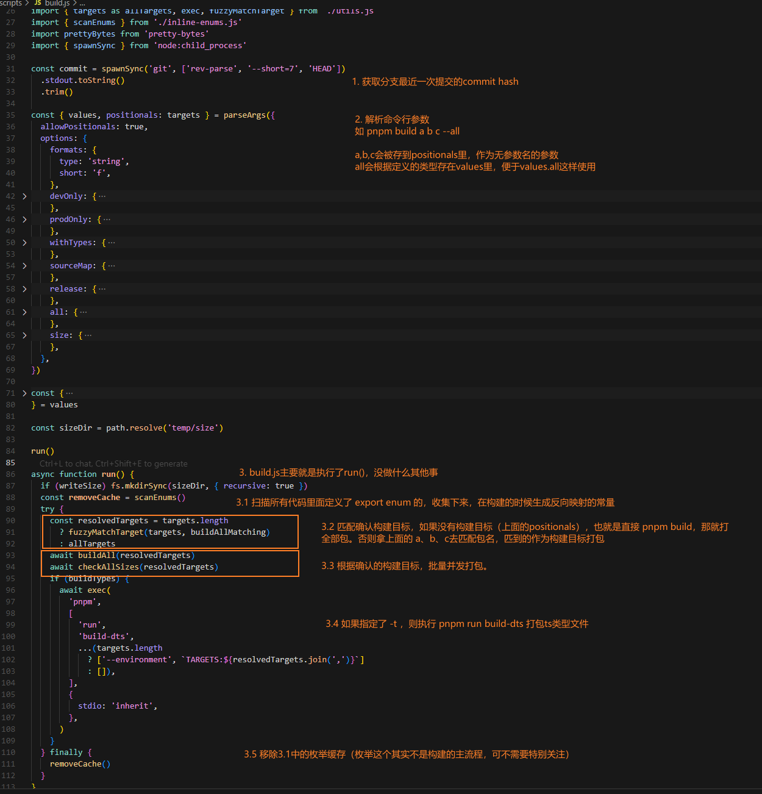

* 第`2`步`parseArgs`，解析命令行参数，是高版本node自带的工具：
  
  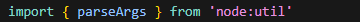

* 第`3.1`步`scanEnums`，扫描枚举反转映射，是一个骚操作，后文会详细叙述；
* 第`3.2`步`fuzzyMatchTarget`，代码就不展开了，匹配构建目标，如果指定了`--all`，则取匹配到的所有包，否则只取匹到的第一个包。
* 第`3.3`步`buildAll`，也是一个骚操作，根据cpu核数作为批量大小，起多个rollup进程打包，每个进程对应一个包的入口文件。
  
  比如核数是4，共有6个包要打，就先并发4个包，一个包完成后下一个包进来。直到打完全部；这里是执行下面`build`方法。
  
  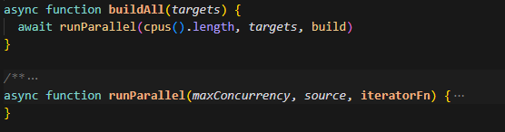

  build方法如下：

  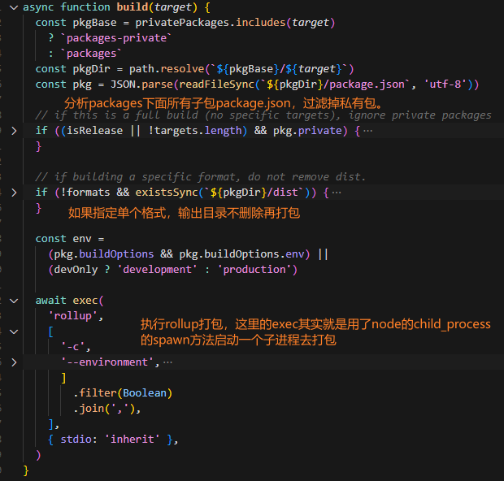

  再来看`rollup.config.js`：

  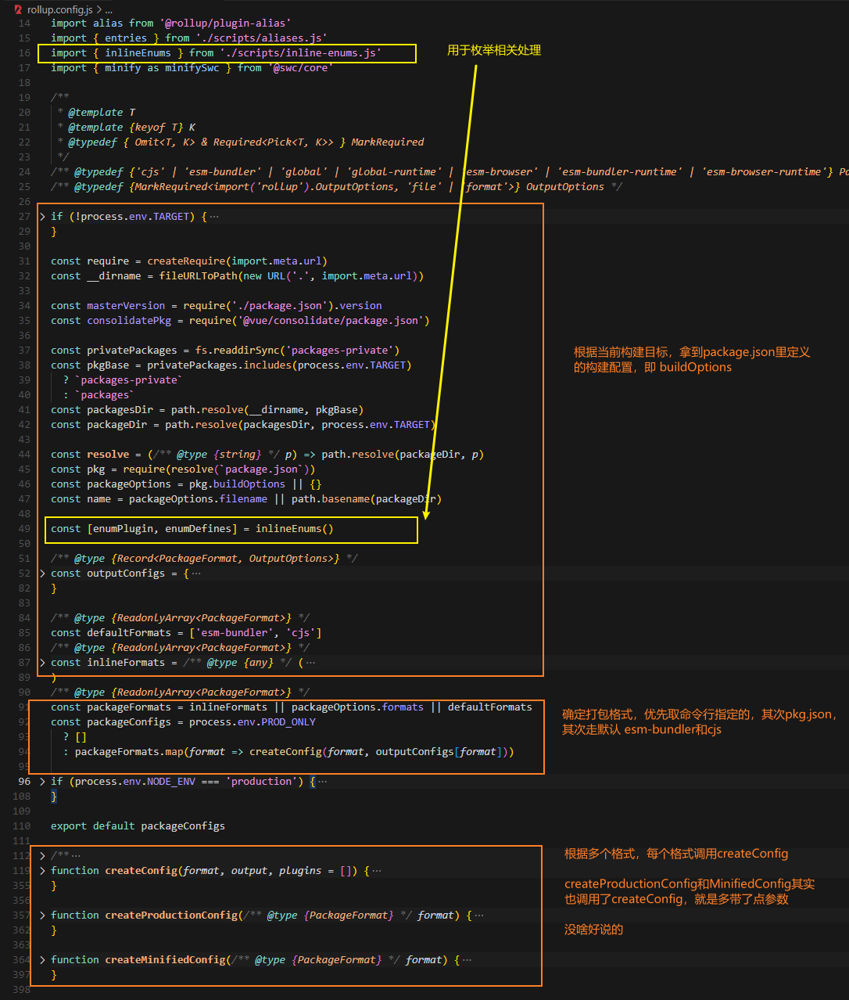

  这里有个枚举的骚操作（上图黄色），其实做的事情，就是在上面3.1时，利用`git grep`命令查找到所有带`export enum`字样的文件，收集到所有的枚举。（利用babel编译，解析成AST，提取成一个json结构存在缓存json文件里）。

  然后在rollup构建的时候，又通过这个插件，找到这些定义枚举的地方，转换成反向映射的常量，比如：

  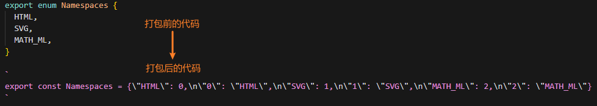


* 第`3.5`步，移除上面说的枚举缓存json，此时所有入口的打包完成。

## 初识渲染系统

先从一个demo开始，执行`pnpm serve`，自己写一个html，看看Vue渲染做了什么：

::: code-group
```html [demo.html]
<div id="root"></div>
<script>
  const { createApp, h, ref } = Vue
  const rootProps = {
    text: '测试文本'
  }
  const app = createApp({
    props: {
      text: { type: String }
    },
    setup(props, setupContext) {
      const randomNum = ref(Math.random())
      const refresh = () => {
        randomNum.value = Math.random()
      }
      return () => {
        return h('div', [
          'Text1',
          h('span', ['Span Text']),
          h('span', [props.text]),
          h('p', [
            h('button', { onClick: refresh }, '点我'),
            randomNum.value
          ]),
          'Text2'
        ])
      }
    }
  }, rootProps)
  app.mount('#root')
</script>
```

```json [在VSCode中调试]
  {
    "type": "chrome",
    "request": "launch",
    "name": "Vue 3 playground - patch",
    "skipFiles": ["<node_internals>/**", "**/node_modules/**"],
    "sourceMaps": true,
    "url": "http://localhost:3000/playground/patch"
  }
```
:::

### createApp的执行

从进入createApp开始摘录如下：

::: code-group

```ts [runtime-dom/src/index.ts]
export const createApp = ((...args) => {
  // （懒）创建一个单例渲染器，调用渲染器的createApp方法
  const app = ensureRenderer().createApp(...args) // [!code highlight]
  // 在app.mount方法再包一层
  const { mount } = app
  app.mount = (containerOrSelector: Element | ShadowRoot | string): any => { // [!code highlight]
    /* 稍后说明... */
  }
  return app // [!code highlight]
}) as CreateAppFunction<Element>

function ensureRenderer() {
  return (
    renderer ||
    (renderer = createRenderer<Node, Element | ShadowRoot>(rendererOptions))
  )
}
```

```ts [runtime-dom/src/renderer.ts]
// 创建一个基础渲染器
export function createRenderer</* ... */>(options) {
  return baseCreateRenderer<HostNode, HostElement>(options)
}

function baseCreateRenderer(
  options: RendererOptions,
  createHydrationFns?: typeof createHydrationFunctions,
): any {
  /* 这里会根据options，定义超级超级多用于渲染patch的方法! */
  /* 此处跳过 2k 行代码 */
  const render: RootRenderFunction = (vnode, container, namespace) => { // [!code highlight]
    if (vnode == null) {
      // 用于卸载的渲染
      if (container._vnode) {
        unmount(container._vnode, null, null, true)
      }
    } else {
      // 比对新老节点
      patch(
        container._vnode || null, // 旧的vnode
        vnode, // 新的vnode
        container, // DOM容器
        null,
        null,
        null,
        namespace,
      )
    }
    // _vnode是用来标识当前DOM对应视图上的vnode的，有_vnode说明有视图，可以被卸载。
    // 初始渲染时，没有_vnode
    container._vnode = vnode
    /* ... */
  }
  /* ... */
  return { // [!code highlight:4]
    render,
    hydrate, // 不是ssr渲染的話就是undefined
    createApp: createAppAPI(render, hydrate),
  }
}
```
:::

可以看到，也就是这么个调用链路，不算很复杂。这里有个render方法后面会调用。

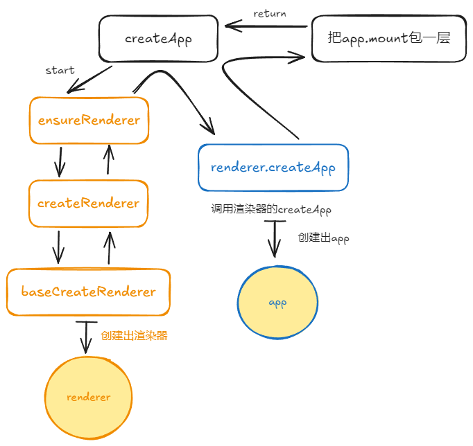

渲染器就是这样一个对象：

```ts
{
  render, // 用于后续app.mount时的渲染
  hydrate,
  createApp: createAppAPI(render, hydrate),
}
```

再来看App是个什么东西，进入`renderer.createApp`如下方代码，可以看出，创建app后，再经过刚刚说的app.mount包一层，最后返回给demo里的代码。其实app.mount就是获取了以下DOM，处理一些特殊逻辑，开启app的挂载流程。

::: code-group

```ts [runtime-core/src/apiCreateApp.ts]
// 用来创建App上下文
export function createAppContext(): AppContext {
  return {
    app: null as any,
    config: {
      isNativeTag: NO,
      performance: false,
      globalProperties: {},
      optionMergeStrategies: {},
      errorHandler: undefined,
      warnHandler: undefined,
      compilerOptions: {},
    },
    mixins: [], // 注册的mixin
    components: {}, // 注册的组件
    directives: {}, // 注册的指令
    provides: Object.create(null),
    optionsCache: new WeakMap(),
    propsCache: new WeakMap(),
    emitsCache: new WeakMap(),
  }
}
export function createAppAPI<HostElement>( // [!code highlight:4]
  render: RootRenderFunction<HostElement>,
  hydrate?: RootHydrateFunction,
): CreateAppFunction<HostElement> {
  /* **renderer.createApp执行这里** */
  /* **renderer.createApp执行这里** */
  return function createApp(rootComponent, rootProps = null) { // [!code highlight]
    /* 省略一些不太重要的前置逻辑... */
    const context = createAppContext() // 创建app上下文 // [!code highlight]
    const installedPlugins = new WeakSet() // 通过app.use安装的插件
    const pluginCleanupFns: Array<() => any> = [] // 一个数组，用于存储app.unmount时需要执行的函数

    let isMounted = false

    const app: App = (context.app = { // [!code highlight]
      _uid: uid++,
      _component: rootComponent as ConcreteComponent,
      _props: rootProps,
      _container: null,
      _context: context,
      _instance: null,
      version,

      get config() {
        return context.config
      },
      set config(v) {
        /* 警告：不支持被设置 */
      },

      use(plugin: Plugin, ...options: any[]) {
        /* 注册插件逻辑... */
        return app
      },

      mixin(mixin: ComponentOptions) {
        /* mixin仅支持选项API（即不是组合式API），否则警告 */
        return app
      },

      component(name: string, component?: Component): any {
          if (!component) {
            /* 获取组件 */
            return context.components[name]
          }
          /* ... */
          // 注册组件
          context.components[name] = component
          return app
      },

      directive(name: string, directive?: Directive) {
        /* 指令注册逻辑与组件相似 */
      },

      // 注意这里的mount的rootContainer是对象，平时用可以传'#app'这种是因为vue额外包了一层
      mount( // [!code highlight:5]
        rootContainer: HostElement,
        isHydrate?: boolean,
        namespace?: boolean | ElementNamespace,
      ): any {
        if (!isMounted) {
          if (__DEV__ && (rootContainer as any).__vue_app__) {
            /* ... */ // 开发环境下检查是否是已挂载的容器，是则警告，因为后面要挂载
          }
          // 创建vnode
          const vnode = app._ceVNode || createVNode(rootComponent, rootProps) // [!code highlight]
          vnode.appContext = context
          /* ... */
          if (isHydrate && hydrate) {
            // ssr渲染用
            hydrate(vnode as VNode<Node, Element>, rootContainer as any)
          } else {
            render(vnode, rootContainer, namespace) // [!code highlight]
          }
          isMounted = true
          app._container = rootContainer
          ;(rootContainer as any).__vue_app__ = app
          /* ... */
          // 后续展开
          return getComponentPublicInstance(vnode.component!)
        } else if (__DEV__) {
            /* 该app已被挂载警告 */
        }
      },

      onUnmount(cleanupFn: () => void) {
        /* ... */
        // 将app.unmount时需要执行的函数push到pluginCleanupFns数组
        pluginCleanupFns.push(cleanupFn)
      },

      unmount() {
        if (isMounted) {
          // 并发执行pluginCleanupFns数组中的所有函数
          callWithAsyncErrorHandling(
            pluginCleanupFns,
            app._instance,
            ErrorCodes.APP_UNMOUNT_CLEANUP,
          )
          render(null, app._container)
          /* ... */
          delete app._container.__vue_app__
        } else if (__DEV__) {
          /* 未挂载的app不能被卸载 */
        }
      },

      provide(key, value) {
        /* 开发环境将检查该key是否已被provide */
        context.provides[key as string | symbol] = value

        return app
      },

      runWithContext(fn) {
        const lastApp = currentApp
        currentApp = app
        try {
          return fn()
        } finally {
          currentApp = lastApp
        }
      },
    }) // app定义结束 // [!code highlight]

    if (__COMPAT__) {
      /* 兼容模式下安装filter等一些过时特性 */
      installAppCompatProperties(app, context, render)
    }

    return app
  }
}
```

```ts [runtime-dom/src/index.ts]
app.mount = (containerOrSelector: Element | ShadowRoot | string): any => {
  // 将挂载容器参数转为合法的DOM元素
  const container = normalizeContainer(containerOrSelector)
  if (!container) return

  const component = app._component
  if (!isFunction(component) && !component.render && !component.template) {
    /* 非函数式组件且没有render和template，则innerHTML会作为template，但需要在compile版本Vue下执行 */
    component.template = container.innerHTML
    /* ... */
  }

  // clear content before mounting
  if (container.nodeType === 1) {
    container.textContent = ''
  }
  // 开启app挂载渲染过程
  const proxy = mount(container, false, resolveRootNamespace(container))
  if (container instanceof Element) {
    container.removeAttribute('v-cloak')
    container.setAttribute('data-v-app', '')
  }
  return proxy
}

function normalizeContainer(
  container: Element | ShadowRoot | string
): Element | null {
  /* '#app' 或 DOM元素   ===>  DOM元素 */
  if (isString(container)) {
    const res = document.querySelector(container)
    /* ... */
    return res
  }
  if (
    __DEV__ &&
    window.ShadowRoot &&
    container instanceof window.ShadowRoot &&
    container.mode === 'closed'
  ) {
    /* shadowRoot closed 警告 */
  }
  return container as any
}
```
:::

### VNode的创建

在上面app.mount挂载时，又会创建VNode，会使用 shapeFlag 作为特性标志位，其枚举值遵循：

```ts
/* packages/shared/src/shapeFlags.ts */
const enum ShapeFlags {
  ELEMENT = 1, // 普通html元素
  FUNCTIONAL_COMPONENT = 1 << 1, // 函数式组件 0b10
  STATEFUL_COMPONENT = 1 << 2, // 有状态组件 0b100
  TEXT_CHILDREN = 1 << 3, // children是一个文本（有别于vue2）
  ARRAY_CHILDREN = 1 << 4, // children是数组
  SLOTS_CHILDREN = 1 << 5,
  TELEPORT = 1 << 6,
  SUSPENSE = 1 << 7,
  COMPONENT_SHOULD_KEEP_ALIVE = 1 << 8,
  COMPONENT_KEPT_ALIVE = 1 << 9, // 在keep-alive中的组件
  COMPONENT = ShapeFlags.STATEFUL_COMPONENT | ShapeFlags.FUNCTIONAL_COMPONENT // 组件 0b110
}
```

这些特性并不完全是互斥关系，因此通过二进制位标记方式，可以很好的实现VNode的特性判断。例如要判断一个vnode对象是否是一个children为数组的有状态组件vnode，只需`Boolean(vnode.shapeFlag | (ShapeFlags.STATEFUL_COMPONENT & ShapeFlags.ARRAY_CHILDREN))`即可。

接下来看VNode代码（这地方的逻辑非常套娃）：

::: code-group

```ts [runtime-core/src/vnode.ts]
/* 省略了部分类型定义，可以看到开发环境下，runtime-core包暴露了transformVNodeArgs，
可以用来调试，拦截篡改VNode的创建结果 */
export const createVNode = (__DEV__ ? createVNodeWithArgsTransform : _createVNode)  // [!code highlight]
export function transformVNodeArgs(transformer?: typeof vnodeArgsTransformer): void {
  vnodeArgsTransformer = transformer
}
const createVNodeWithArgsTransform = (...args): VNode => {
  return _createVNode(
    ...(vnodeArgsTransformer
      ? vnodeArgsTransformer(args, currentRenderingInstance)
      : args),
  )
}
// 再来看看_createVNode: 

function _createVNode(
  type: VNodeTypes | ClassComponent | typeof NULL_DYNAMIC_COMPONENT,
  props: (Data & VNodeProps) | null = null,
  children: unknown = null,
  patchFlag: number = 0,
  dynamicProps: string[] | null = null,
  isBlockNode = false,
): VNode {
    /* ... */ // type为空或为 NULL_DYNAMIC_COMPONENT，将作为Comment处理

  if (isVNode(type)) {
    /* ... */ // 如果type本身是一个vnode则克隆一个vnode
    return cloned
  }
  /* ... */
  // class & style normalization.
  if (props) {
    props = guardReactiveProps(props)! // 针对响应式props对象（即是一个proxy），返回Object.assign({}, props)
    /* ... */ // class, style的各种格式处理（字符串、数组、对象）
  }
  // 设置一个初始的shapeFlag // [!code highlight]
  const shapeFlag = isString(type)
    ? ShapeFlags.ELEMENT
    : __FEATURE_SUSPENSE__ && isSuspense(type)
      ? ShapeFlags.SUSPENSE
      : isTeleport(type)
        ? ShapeFlags.TELEPORT
        : isObject(type)
          ? ShapeFlags.STATEFUL_COMPONENT
          : isFunction(type)
            ? ShapeFlags.FUNCTIONAL_COMPONENT
            : 0
  /* ... */
  return createBaseVNode( // [!code highlight]
    type,
    props,
    children,
    patchFlag,
    dynamicProps,
    shapeFlag,
    isBlockNode,
    true,
  )
}
```

```ts [createBaseVNode]
function createBaseVNode(
  type,
  props = null,
  children = null,
  patchFlag = 0,
  dynamicProps = null,
  shapeFlag = type === Fragment ? 0 : ShapeFlags.ELEMENT,
  isBlockNode = false,
  needFullChildrenNormalization = false
) {
  const vnode = { // [!code highlight]
    __v_isVNode: true, // isVNode的判断标识
    __v_skip: true,
    type, // vnode类型，VNodeTypes | ClassComponent | typeof NULL_DYNAMIC_COMPONENT
    props,
    key: props && normalizeKey(props), // vnode的key，作为patch时的判断依据
    ref: props && normalizeRef(props),
    scopeId: currentScopeId,
    slotScopeIds: null,
    children,
    component: null, // 在 patch - mountComponent 时将创建组件实例并赋值
    /* ... */
    el: null, // 渲染的DOM元素
    /* ... */
    shapeFlag, // 二进制类型标志位
    patchFlag, // 用于patch过程，通过compiler编译的会有一些patchFlag用于渲染的优化
    dynamicProps,
    dynamicChildren: null,
    appContext: null // 在作为app根vnode会在mount时机设置为app的上下文
  } as VNode // vnode定义结束 [!code highlight]

  if (needFullChildrenNormalization) {
    // 根据children类型为vnode.shapeFlag赋值
    normalizeChildren(vnode, children) // [!code highlight]
    /* ... */
  } else if (children) {
    /* 通过编译调用的createBaseVNode，children只可能为数组或文本text */
    vnode.shapeFlag |= isString(children)
      ? ShapeFlags.TEXT_CHILDREN
      : ShapeFlags.ARRAY_CHILDREN
  }
  /* ... */

  return vnode
}

export type VNodeTypes =
  | string
  | VNode
  | Component
  | typeof Text
  | typeof Static
  | typeof Comment
  | typeof Fragment
  | typeof Teleport
  | typeof TeleportImpl
  | typeof Suspense
  | typeof SuspenseImpl
```
:::

结合`ShapeFlags`的定义可以知道，创建VNode时，起初会判断`type`设定一个初始的`shapeFlag`：
| type值                                  | shapeFlag                       |
| --------------------------------------- | ------------------------------- |
| 是string                                | ShapeFlags.ELEMENT              |
| 开启了__FEATURE_SUSPENSE__ 且是Suspense | ShapeFlags.SUSPENSE             |
| 是Teleport                              | ShapeFlags.TELEPORT             |
| 是对象                                  | ShapeFlags.STATEFUL_COMPONENT   |
| 是函数                                  | ShapeFlags.FUNCTIONAL_COMPONENT |
| 其他情况                                | 0                               |

再走下一步的逻辑。值得一提的是，还有一种常见方式可以创建VNode就是通过`h`函数，上方[demo](#渲染系统)就使用了`h`。来看看h的源码：

::: code-group
```ts [runtime-core/src/h.ts]
export function h(type: any, propsOrChildren?: any, children?: any): VNode {
  const l = arguments.length
  if (l === 2) {
    // 只有两个参数，第二个参数是个对象
    if (isObject(propsOrChildren) && !isArray(propsOrChildren)) {
      // 那么第二个参数本身就是个VNode，要包进数组中
      if (isVNode(propsOrChildren)) {
        return createVNode(type, null, [propsOrChildren])
      }
      // 或者是children为null，那么propsOrChildren就是个props，比如{ onClick: () => {}, ... } 这样的
      return createVNode(type, propsOrChildren)
    } else {
      // 不是对象，那只能是children了
      return createVNode(type, null, propsOrChildren)
    }
  } else {
    // 有三个或以上参数
    if (l > 3) {
      // 从第三个参数开始，都是children
      children = Array.prototype.slice.call(arguments, 2)
    } else if (l === 3 && isVNode(children)) {
      // 如果第三个参数是VNode，类似上面逻辑，也要包一层为数组
      children = [children]
    }
    return createVNode(type, propsOrChildren, children)
  }
}
```

```ts [normalizeChildren]
export function normalizeChildren(vnode: VNode, children: unknown): void {
  let type = 0
  const { shapeFlag } = vnode
  if (children == null) { // [!code highlight]
    // 如果没有children
    children = null
  } else if (isArray(children)) { // [!code highlight]
    // 如果传了个数组children
    type = ShapeFlags.ARRAY_CHILDREN
  } else if (typeof children === 'object') { // [!code highlight]
    // 可能直接就是个vnode
    if (shapeFlag & (ShapeFlags.ELEMENT | ShapeFlags.TELEPORT)) {
      /* ... */
      return
    } else {
      type = ShapeFlags.SLOTS_CHILDREN
      /* ... */
    }
  } else if (isFunction(children)) { // [!code highlight]
    // children是函数，是插槽的一种用法
    children = { default: children, _ctx: currentRenderingInstance }
    type = ShapeFlags.SLOTS_CHILDREN
  } else { // [!code highlight]
    children = String(children)
    // force teleport children to array so it can be moved around
    if (shapeFlag & ShapeFlags.TELEPORT) {
      /* 如果vnode是Teleport，则children转为为数组 */
      type = ShapeFlags.ARRAY_CHILDREN
      children = [createTextVNode(children as string)]
    } else {
      type = ShapeFlags.TEXT_CHILDREN
    }
  }
  vnode.children = children as VNodeNormalizedChildren
  vnode.shapeFlag |= type
}

```
:::

可以看到，使用`h`可以有很多方式，比如：
```js
h('div')
h('div', '文本')
h('div', ['文本'])
h('div', vnode)
h('div', [vnode1, '文本', vnode2])
h('div', {}, [vnode1, '文本', vnode2])
```

在创建VNode时，又会调用`normalizeChildren`，进一步补充最初的`shapeFlag`。通过源码可以知道，`h('div', '文本')`会把vnode的shapeFlag设为`ShapeFlags.TEXT_CHILDREN`，而`h('div', ['文本'])`会把vnode的shapeFlag设为`ShapeFlags.ARRAY_CHILDREN`。

VNode创建后，执行就回到了`app.mount`里，此时关注`render`方法，该方法是之前创建的渲染器的render方法，请见[上文runtime-dom/src/renderer.ts](#createapp的执行)：

```ts [runtime-core/src/apiCreateApp.ts]
/* ... */
mount(
  rootContainer: HostElement,
  isHydrate?: boolean,
  namespace?: boolean | ElementNamespace,
): any {
  /* ... */
  const vnode = app._ceVNode || createVNode(rootComponent, rootProps) // [!code highlight]
  vnode.appContext = context
  /* ... */
  render(vnode, rootContainer, namespace) // [!code focus]
  /* ... */
},
```

综上，`app.mount`调用链路可以概括如下图：

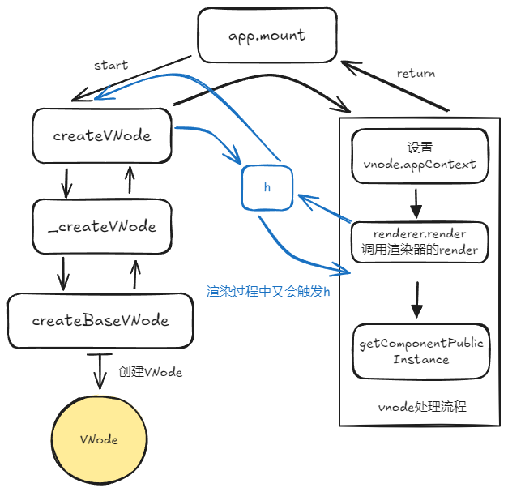

### render方法

在[上文runtime-dom/src/renderer.ts](#createapp的执行)中可知render方法走了`patch`，来看看代码：

::: code-group
```ts [runtime-core/src/renderer.ts]
const patch: PatchFn = (
  n1,
  n2,
  container,
  anchor = null,
  parentComponent = null,
  parentSuspense = null,
  namespace = undefined,
  slotScopeIds = null,
  optimized = __DEV__ && isHmrUpdating ? false : !!n2.dynamicChildren,
) => {
  if (n1 === n2) {
    return
  }

  if (n1 && !isSameVNodeType(n1, n2)) {
    anchor = getNextHostNode(n1)
    unmount(n1, parentComponent, parentSuspense, true)
    n1 = null
  }

  /* ... */

  const { type, ref, shapeFlag } = n2
  switch (type) {
    case Text:
      processText(n1, n2, container, anchor) // [!code highlight]
      break
    case Comment:
      processCommentNode(n1, n2, container, anchor) // [!code highlight]
      break
    case Static:
      /* 静态节点相关，先忽略 */
      break
    case Fragment:
      processFragment(/* ... */) // [!code highlight]
      break
    default:
      if (shapeFlag & ShapeFlags.ELEMENT) {
        processElement(/* ... */) // [!code highlight]
      } else if (shapeFlag & ShapeFlags.COMPONENT) {
        processComponent(/* ... */) // [!code highlight]
      } else if (shapeFlag & ShapeFlags.TELEPORT) {
        ;(type as typeof TeleportImpl).process(/* ... */) // [!code highlight]
      } else if (__FEATURE_SUSPENSE__ && shapeFlag & ShapeFlags.SUSPENSE) {
        ;(type as typeof SuspenseImpl).process(/* ... */) // [!code highlight]
      } else if (__DEV__) {
        warn('Invalid VNode type:', type, `(${typeof type})`)
      }
  }

  if (ref != null && parentComponent) {
    setRef(ref, n1 && n1.ref, parentSuspense, n2 || n1, !n2)
  }
}
```

```ts [isSameVNodeType]
export function isSameVNodeType(n1: VNode, n2: VNode): boolean {
  /* ... */
  return n1.type === n2.type && n1.key === n2.key
}
```

```ts [processElement]
const processElement = (/* ... */) => {
  /* ... */
  if (n1 == null) {
    // 没有旧vnode，底层直接调DOM API渲染
    mountElement(n2， /* ... */)
  } else {
    // 比对新旧vnode
    patchElement(
      n1,
      n2,
      parentComponent,
      parentSuspense,
      namespace,
      slotScopeIds,
      optimized,
    )
  }
}
```

```ts [processComponent]
const processComponent = (/* ... */) => {
  n2.slotScopeIds = slotScopeIds
  if (n1 == null) {
    if (n2.shapeFlag & ShapeFlags.COMPONENT_KEPT_ALIVE) {
      /* keep-alive逻辑 */
    } else {
      mountComponent(n2, /* ... */)
    }
  } else {
    // 更新组件
    updateComponent(n1, n2, optimized)
  }
}
```

:::

可以看到过程就是这么个图：

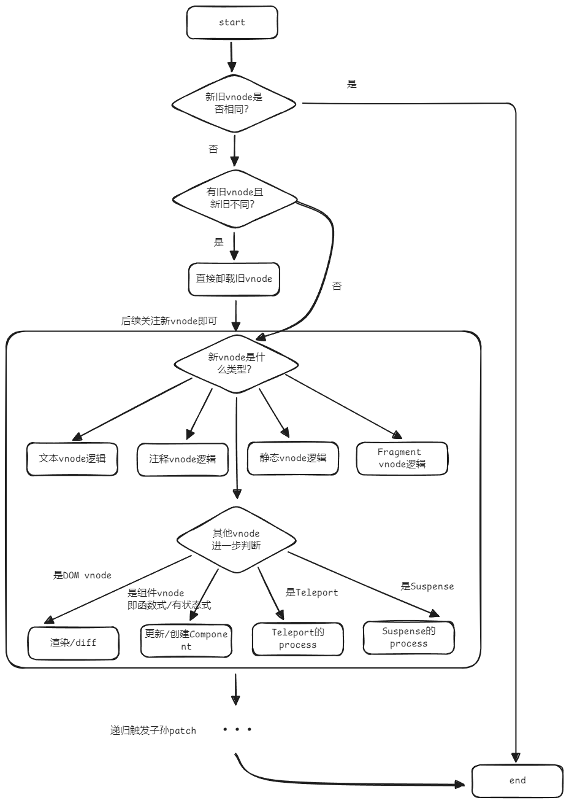

判断两个vnode是否相同的依据是`type`和`key`都相同。体现在DOM就是标签和key分别相同，体现在组件就是定义组件的对象和key分别相同。

关于注释节点、文本vnode逻辑没啥好说的。重点是 processElement和processComponent，如果没有旧vnode就直接渲染就行，是element就创建DOM，是component就创建组件实例。

### 组件的创建与更新

步骤是：

1. 创建组件实例
2. 安装组件，即执行`setup`
3. 安装组件的<渲染effect>

调用链路如下（以下忽略了服务端渲染及一些边缘的情况，且主要体现有状态组件的逻辑）：

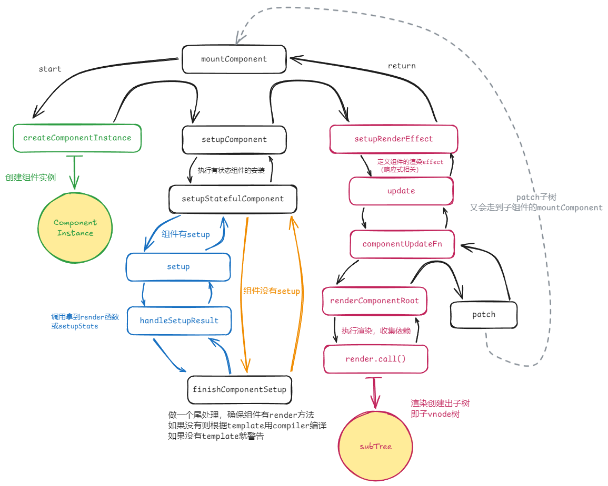

::: code-group

```ts [createComponentInstance]
export function createComponentInstance(
  vnode: VNode,
  parent: ComponentInternalInstance | null,
  suspense: SuspenseBoundary | null,
): ComponentInternalInstance {
  const type = vnode.type as ConcreteComponent
  // inherit parent app context - or - if root, adopt from root vnode
  const appContext =
    (parent ? parent.appContext : vnode.appContext) || emptyAppContext

  const instance: ComponentInternalInstance = { // [!code highlight]
    uid: uid++,
    vnode, // 组件实例绑定的vnode
    type, // 组件实例对应的vnode type，即定义的对象
    parent,
    appContext,
    root: null!, // to be immediately set
    next: null,
    subTree: null!, // 子vnode树，即通过render渲染并格式化的vnode树
    effect: null!, // 在执行setupRenderEffect方法时被赋值，代表组件更新的作用，包装了patch子节点的渲染过程
    update: null!, // will be set synchronously right after creation
    job: null!,
    scope: new EffectScope(true /* detached */),
    render: null,
    proxy: null, // 渲染代理，在setupStatefulComponent中被设置
    exposed: null, // 组件暴露的状态
    exposeProxy: null, // 访问实例exposed的代理
    withProxy: null,
    /* ... */

    /* 局部注册的组件、指令 */
    components: null,
    directives: null,

    /* 根据组件暴露给父组件的props和emits，处理成options */
    propsOptions: normalizePropsOptions(type, appContext),
    emitsOptions: normalizeEmitsOptions(type, appContext),

    emit: null!, // 组件的emit方法，将在下文被赋值
    emitted: null,
    propsDefaults: EMPTY_OBJ,
    inheritAttrs: type.inheritAttrs, // 是否透传attrs

    ctx: EMPTY_OBJ,
    data: EMPTY_OBJ,
    props: EMPTY_OBJ,
    attrs: EMPTY_OBJ,
    slots: EMPTY_OBJ,
    refs: EMPTY_OBJ,
    setupState: EMPTY_OBJ,
    setupContext: null,
    /* ... */

    // lifecycle hooks
    // not using enums here because it results in computed properties
    isMounted: false,
    isUnmounted: false,
    isDeactivated: false,
    bc: null, // 参考LifeCycleHooks可知：beforeCreate
    c: null, // 参考LifeCycleHooks可知：created
    bm: null, // 参考LifeCycleHooks可知：beforeMount
    m: null, // 参考LifeCycleHooks可知：mounted
    bu: null, // 参考LifeCycleHooks可知：beforeUpdate
    u: null, // 参考LifeCycleHooks可知：updated
    um: null, // 参考LifeCycleHooks可知：unmount
    bum: null, // 参考LifeCycleHooks可知：beforeUnmount
    da: null, // 参考LifeCycleHooks可知：deactivated
    a: null, // 参考LifeCycleHooks可知：activated
    rtg: null, // 参考LifeCycleHooks可知：renderTriggered
    rtc: null, // 参考LifeCycleHooks可知：renderTracked
    ec: null, // 参考LifeCycleHooks可知：errorCaptured
    sp: null // 参考LifeCycleHooks可知：serverPrefetched
  }
  /* ... */
  instance.root = parent ? parent.root : instance
  instance.emit = emit.bind(null, instance)

  // 组件实例创建后的自定义钩子调用：customElement // [!code highlight:3]
  if (vnode.ce) {
    vnode.ce(instance)
  }

  return instance
}
```

```ts [setupComponent]
export function setupComponent(
  instance: ComponentInternalInstance,
  isSSR = false,
  optimized = false,
): Promise<void> | undefined {
  /* ... */
  const { props, children } = instance.vnode
  const isStateful = isStatefulComponent(instance) // 通过vnode的shapeFlag判断
  initProps(instance, props, isStateful, isSSR) // 初始化props，提取props，attrs，并设置props响应式，赋值给实例
  initSlots(instance, children) // 初始化插槽
  const setupResult = isStateful
    ? setupStatefulComponent(instance, isSSR) // 调用用户定义的setup，并确保实例包含render方法
    : undefined
  /* ... */
  return setupResult
}
```

```ts [setupStatefulComponent]
function setupStatefulComponent(instance, isSSR) {
  const Component = instance.type as ComponentOptions // 拿到定义【有状态组件】的对象
  // ... /* 执行一些 components, directives 名的校验 */

  // 0. create render proxy property access cache
  instance.accessCache = Object.create(null)
  // 1. 渲染代理，用作render被call时的this指向，且不能被响应式监听
  instance.proxy = markRaw(new Proxy(instance.ctx, PublicInstanceProxyHandlers))
  /* ... */
  // 2. call setup()
  const { setup } = Component
  if (setup) {
    // 按需创建setup上下文
    const setupContext = (instance.setupContext = setup.length > 1 ? createSetupContext(instance) : null)

    setCurrentInstance(instance) // 设置当前活动的组件实例
    pauseTracking() // 响应式相关
    // 调用带异常捕获的组件setup
    const setupResult = callWithErrorHandling(setup, instance, /* ... */)
    resetTracking() // 响应式相关
    unsetCurrentInstance() // 移除当前活动的组件实例

    if (isPromise(setupResult)) {
      /* ... */ // 异步setup处理
    } else {
      /* handleSetupResult: setupResult是函数则赋值到实例的render，否则作为响应式setupState，再调用finishComponentSetup */
      handleSetupResult(instance, setupResult, isSSR)
    }
  } else {
    finishComponentSetup(instance, isSSR)
  }
}
```

```ts [finishComponentSetup]
export function finishComponentSetup(
  instance: ComponentInternalInstance,
  isSSR: boolean,
  skipOptions?: boolean,
): void {
  const Component = instance.type as ComponentOptions

  /* ... */

  /* ... */ // 确保组件有render的一些逻辑，如果没有render但有template和compile，则使用编译器编译出render

  // support for 2.x options；支持选项式API和一些生命周期，且由此可知setup时机在其之前
  if (__FEATURE_OPTIONS_API__ && !(__COMPAT__ && skipOptions)) {
    const reset = setCurrentInstance(instance)
    pauseTracking()
    try {
      applyOptions(instance)
    } finally {
      resetTracking()
      reset()
    }
  }

  /* ... */ // 开发环境检查render和template是否存在，并打印对应警告，如运行时版本VUE使用template
}
```

```ts [setupRenderEffect]
const setupRenderEffect: SetupRenderEffectFn = (
  instance,
  initialVNode,
  container,
  anchor,
  parentSuspense,
  namespace: ElementNamespace,
  optimized,
) => {
  const componentUpdateFn = () => { /* ... */ }
  // create reactive effect for rendering
  instance.scope.on()
  const effect = (instance.effect = new ReactiveEffect(componentUpdateFn))
  instance.scope.off()

  const update = (instance.update = effect.run.bind(effect))
  const job: SchedulerJob = (instance.job = effect.runIfDirty.bind(effect))
  job.i = instance
  job.id = instance.uid
  effect.scheduler = () => queueJob(job)

  // allowRecurse
  // #1801, #2043 component render effects should allow recursive updates
  toggleRecurse(instance, true)

  if (__DEV__) {
    effect.onTrack = instance.rtc
      ? e => invokeArrayFns(instance.rtc!, e)
      : void 0
    effect.onTrigger = instance.rtg
      ? e => invokeArrayFns(instance.rtg!, e)
      : void 0
  }

  update()
}
```

```ts [componentUpdateFn]
const componentUpdateFn = () => {
  if (!instance.isMounted) {
    /* 实例初次渲染时还未被挂载 */
    let vnodeHook: VNodeHook | null | undefined
    const { el, props } = initialVNode
    const { bm, m, parent, root, type } = instance
    const isAsyncWrapperVNode = isAsyncWrapper(initialVNode)

    toggleRecurse(instance, false)
    /* ... */ // 执行一些生命周期钩子，这里有一个隐藏hook: onVnodeBeforeMount
    toggleRecurse(instance, true)

    if (el && hydrateNode) {
      /* ... */
    } else {
      /* ... */
      // 创建子树VNode，内部调用组件render方法，此时是在响应式观测内的，将收集依赖
      const subTree = (instance.subTree = renderComponentRoot(instance))
      /* ... */
      patch(
        null,
        subTree,
        container,
        anchor,
        instance,
        parentSuspense,
        namespace,
      )
      /* ... */
      initialVNode.el = subTree.el
    }
    /* ... */
    instance.isMounted = true
    /* ... */
    // 挂载后将container引用DOM置null，防止闭包内引起的内存泄漏
    initialVNode = container = anchor = null as any
  } else {
    /* 更新组件，同样是patch过程 */
    /* ... */
    const nextTree = renderComponentRoot(instance)
    /* ... */
    patch(
      prevTree,
      nextTree,
      // parent may have changed if it's in a teleport
      hostParentNode(prevTree.el!)!,
      // anchor may have changed if it's in a fragment
      getNextHostNode(prevTree),
      instance,
      parentSuspense,
      namespace,
    )
    /* ... */
  }
}
```
:::

### DOM的diff

走到patch时的vnode的children共有三种情况：

1. 纯文本，即 `shapeFlag.TEXT_CHILDREN`;
2. 纯数组，即 `shapeFlag.ARRAY_CHILDREN`;
3. 没有children。

通常如果是经过compiler编译出来的，会有一些patch优化的标识，这里主要在**编译系统**章节再提。如果不是编译系统编译出来的，像是上方写的demo这种，自己调`h`创建出来的vnode，对比时就会走最原始的diff算法。源码类似：

```ts
const patchElement = (
  n1: VNode,
  n2: VNode,
  parentComponent: ComponentInternalInstance | null,
  /* ... */
) => {
  /* ... */
  // dynamicChildren....
  if (!optimized) {
    // full diff
    patchChildren(
      n1,
      n2,
      el,
      null,
      parentComponent,
      parentSuspense,
      resolveChildrenNamespace(n2, namespace),
      slotScopeIds,
      false,
    )
  }
  /* 具有优化的一些diff */
}
```

一次full diff：

| 旧vnode树children | 新vnode树children | 操作                         |
| ----------------- | ----------------- | ---------------------------- |
| 纯文本            | 纯文本            | DOM更新文本                  |
| 没有children      | 纯文本            | DOM更新文本                  |
| 数组              | 纯文本            | 卸载旧vnode数组，DOM更新文本 |
| 数组              | 数组              | **patchKeyedChildren()**           |
| 数组              | 没有children      | 卸载旧vnode数组              |
| 纯文本            | 数组              | 渲染新vnode数组              |
| 没有children      | 数组              | 渲染新vnode数组              |
| 纯文本            | 没有children      | 清空旧DOM文本                |
| 没有children      | 没有children      | 清空旧DOM文本                |

diff过程：

1. 新旧子vnode数组，先从头开始patch相同的vnode;
2. 再从尾开始patch相同的vnode；
3. 再处理仅有新增vnode的情况，进行渲染；
4. 再处理仅有变少vnode的情况，进行卸载；
5. 再处理混合情况，利用最长递增子序列。

### 其他

`异步组件`使用了defineAsyncComponent，本质上是包了一层的组件，但是setup返回的是一个promise（所以其实setup也可以用async/await，官方文档也有说）。然后把后续`handleSetupResult`和`setupRenderEffect`的执行交给`Suspense`的`registerDep`推迟执行。

因为`Suspense`下可能会有多个异步组件，所以会有个`deps`计数，所有promise都结束才归零，完成`Suspense`的`resolve`。在此之前都会`fallback`。

`Suspense`会在`h`创建时，就把所有插槽都执行一遍，创建好子vnode。`Suspense`在patch时其实会patch两遍，第一遍为了确定所有子组件是否有异步的（deps计数），如果有就执行`setActiveBranch`。`Suspense`有两个渲染分支：1. `ssFallback`异步展示 2. `ssContent`正常展示。

```html
<script>
  const { createApp, h, ref, Suspense, defineAsyncComponent } = Vue
  const app = createApp({
    setup(props, setupContext) {
      return () => {
        const AsyncComponent = defineAsyncComponent(() => new Promise((resolve) => {
          setTimeout(() => {
            resolve({
              setup() {
                return () => h('div', [
                  h('span', '666'),
                  h('span', '笑死'),
                ])
              }
            })
          }, 5000)
        }))
        debugger

        return h(Suspense, null, {
          default: () => {
            debugger
            return h('div', [
              h(AsyncComponent),
            ])
          },
          fallback: () => {
            debugger
            return '加载中...'
          }
        })
      }
    }
  })
  app.mount('#root')
</script>
```

<!-- 
当前代码定义了一个名为 PatchFlags 的枚举类型（enum），它用于表示虚拟 DOM（Virtual DOM）节点的不同更新类型或状态。这些标志位（Patch Flags）是由 Vue.js 编译器生成的优化提示，用于在虚拟 DOM 对比（diff）过程中提高性能。

以下是对每个标志位的解释：

TEXT：表示元素的文本内容是动态的，可以快速更新。
CLASS：表示元素的类绑定是动态的。
STYLE：表示元素的样式是动态的，编译器会优化静态样式的处理。
PROPS：表示元素具有非类/样式的动态属性。
FULL_PROPS：表示元素的属性键是动态的，需要完全对比来移除旧的键。
NEED_HYDRATION：表示元素需要 hydration，即从服务器渲染的 HTML 转换为客户端的动态 DOM。
STABLE_FRAGMENT：表示片段（fragment）的子元素顺序不变。
KEYED_FRAGMENT：表示片段具有键值或部分键值的子元素。
UNKEYED_FRAGMENT：表示片段的子元素没有键值。
NEED_PATCH：表示元素只需要非属性的补丁，例如 ref 或指令钩子。
DYNAMIC_SLOTS：表示组件具有动态插槽，例如基于 v-for 循环的插槽或动态插槽名。
DEV_ROOT_FRAGMENT：表示片段仅因为用户在模板根级别放置了注释而创建，这是一个仅在开发模式下存在的标志。
CACHED：表示一个缓存的静态虚拟节点，这也是一个提示，告诉 hydration 过程可以跳过整个子树，因为静态内容不需要更新。
BAIL：表示 diff 算法应该退出优化模式，例如在遇到非编译器生成的插槽或手动克隆的虚拟节点时。
这些标志位可以通过按位或（|）操作进行组合，并且可以通过按位与（&）操作进行检查。例如，const flag = TEXT | CLASS 表示一个同时具有动态文本和动态类的元素。然后可以使用 if (flag & TEXT) {... } 来检查是否存在文本更新。

在 Vue.js 的运行时核心中，patchElement 函数负责处理这些标志位，以实现高效的虚拟 DOM 更新。如果你想深入了解这些标志位是如何在 diff 过程中被使用的，可以查看 '../../runtime-core/src/renderer.ts' 文件中的 patchElement 函数。 -->
<!-- 

## 响应式系统

## 编译系统 -->

<!-- 
## 后面关注
normalizeRef
getComponentPublicInstance有什么用？
flushPreFlushCbs是干嘛的
keep-alive机制
suspense和fragment
渲染过程的optimized
1. Rust
2. esbuild -->
