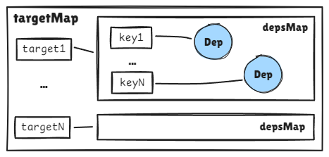
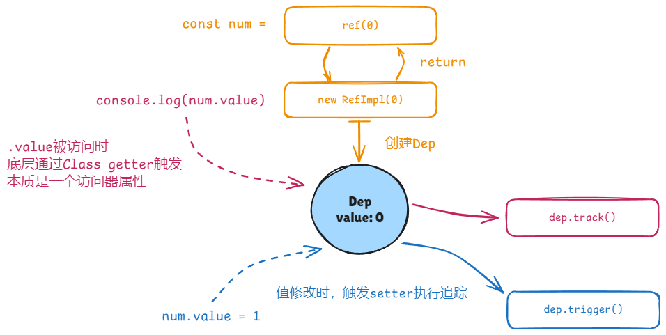
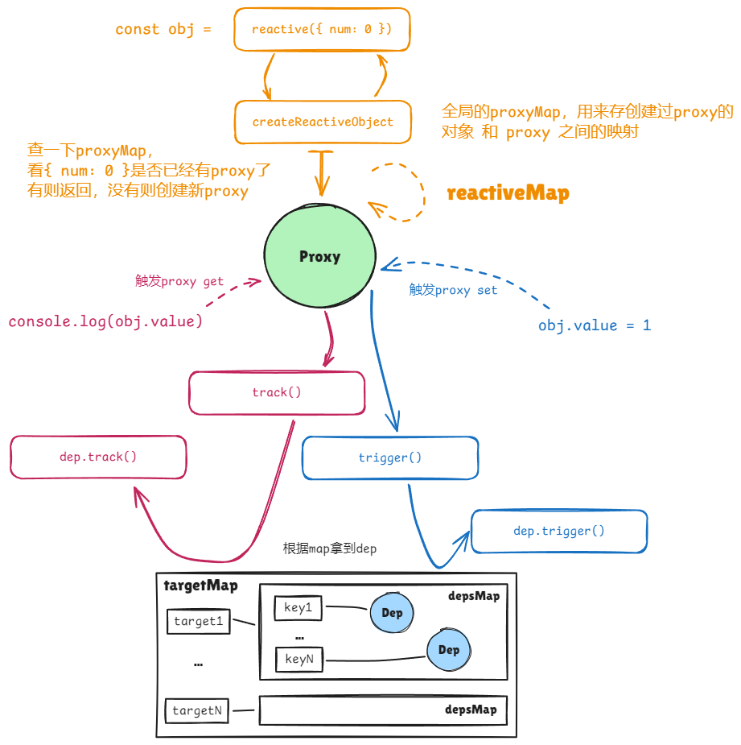
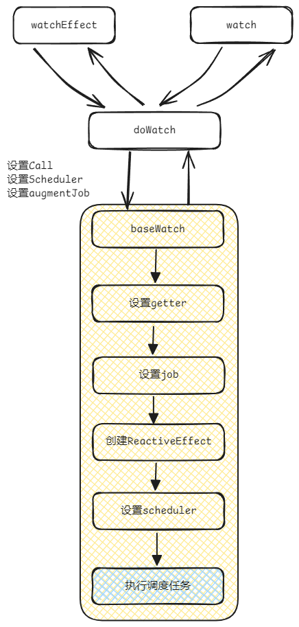
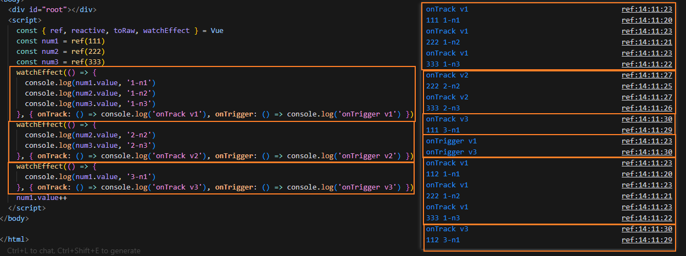
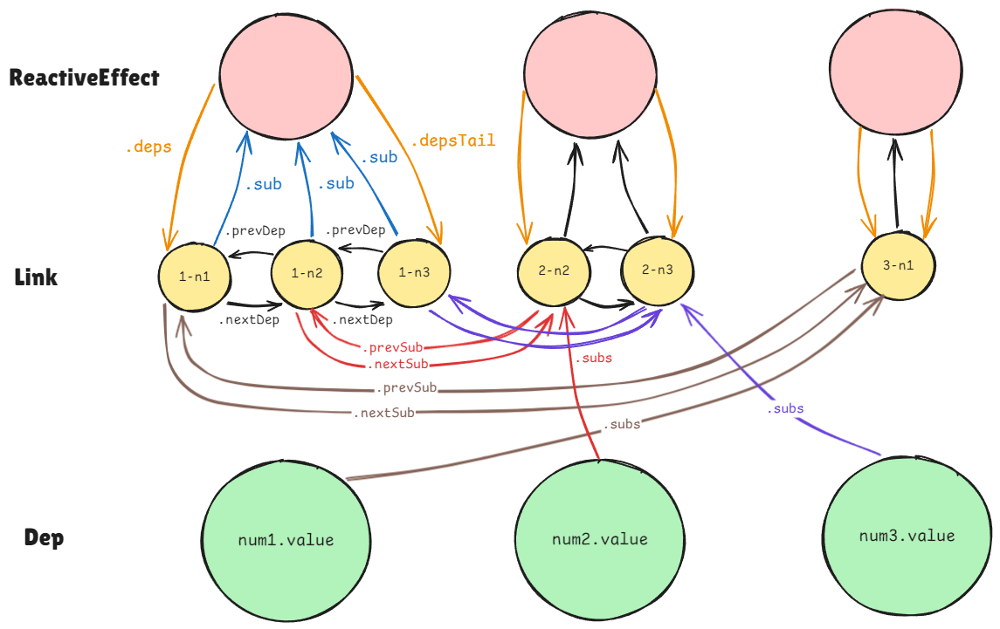
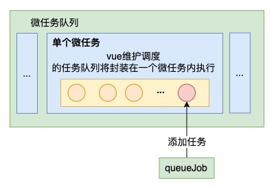
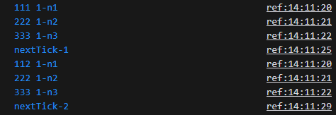
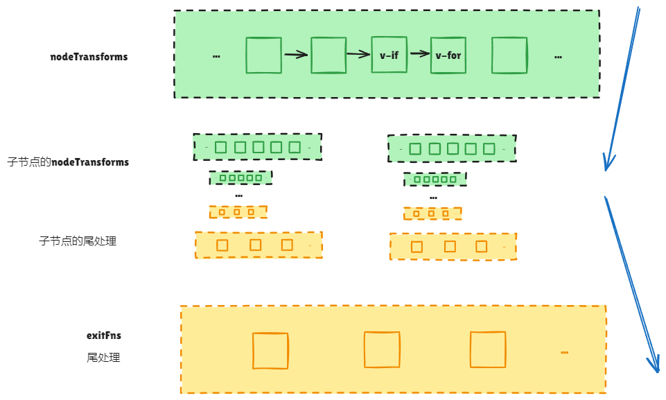

# Vue@3.5.5 源码分析（二）响应式系统与编译

## 响应式系统

### 响应式设计背景

众所周知，Vue3使用了`Proxy`而替代了原有的`Object.defineProperty`提供响应式支持，想要了解响应式的基本逻辑，可以通过Vue3官网极短的**伪代码**帮助我们理解其设计理念。

**预期：** 设`A0 = 1`, `A1 = 2`, `A2 = A0 + A1`。
**期望：** `A0`, `A1`变化时`A2`自动变化；
反映到代码则如下：

```javascript
let A0 = 1
let A1 = 2
let A2 = A0 + A1
function update() {
  A2 = A0 + A1
}
whenDepsChange(update) // 调用后A0, A1改变则update自动执行
```

**拟定伪代码：**

```javascript
// 我们期望reactive能监听一个对象的变动
function reactive(obj) {
  return new Proxy(obj, {
    get(target, key) {
      track(target, key) // 期望在key被访问时追踪这个行为本身
      return target[key]
    },
    set(target, key, value) {
      target[key] = value
      trigger(target, key) // 期望在key被设置时触发一些作用（effect）
    }
  })
}
// 对于非对象值，我们期望能通过一个对象包裹而达到类似reactive方法的目的
function ref(value) {
  const refObject = {
    get value() {
      track(refObject, 'value')
      return value
    },
    set value(newValue) {
      value = newValue
      trigger(refObject, 'value')
    }
  }
  return refObject
}

let activeEffect // 设置一个活动的作用变量，以便在追踪时绑定要追踪的行为本身

function track(target, key) {
  // 在追踪时，有活跃的effect，代表正在被该effect观测
  if (activeEffect) {
    const effects = getSubscribersForProperty(target, key) // 获取到target的key下所有在观测的effects集合
    effects.add(activeEffect) // 添加新的活跃effect
  }
}
function trigger(target, key) {
  const effects = getSubscribersForProperty(target, key) // 获取到target的key下所有在观测的effects集合
  effects.forEach((effect) => effect()) // 挨个触发
}

function whenDepsChange(update) {
  const effect = () => {
    activeEffect = effect // 初次注册副作用，激活
    update() // 依赖收集
    activeEffect = null // 收集结束
  }
  effect()
}
```

在Vue3实际的代码中其实也是围绕上方伪代码实现的，除了`ref`自己维护了dep外（下文可知），`目标对象target`、`键key`、`依赖Dep`的关系可用下图表示：



### `ref`与`reactive`

通过读源码，对于一个普通值调用`ref`，调用链路总结如下：



这是普通值`0`的情况，如果传入的是一个对象，如`ref(obj)`，不考虑`readonly`等特殊情况，那么会调用`toReactive`（底层执行`reactive`）转一层。

再来看`reactive`：



在执行`reactive`时会创建`proxy`，`proxy`的handler是由对象类型决定的，可能会是`baseHandlers`、`collectionHandlers`（其实还有`shallowHandlers`、`readonlyHandlers`，这里不展开）。

```ts
function targetTypeMap(rawType: string) {
  switch (rawType) {
    case 'Object':
    case 'Array':
      return TargetType.COMMON
    case 'Map':
    case 'Set':
    case 'WeakMap':
    case 'WeakSet':
      return TargetType.COLLECTION
    default:
      return TargetType.INVALID
  }
}
```

当实际触发get或set时，会有一个`targetMap`，里面存储了`target`到`depsMap`的映射，`depsMap`里面存储了`key`到`dep`的映射，`dep`和`key`的关系是一对一的关系。

以上可以看到不论是`reactive`还是`ref`，都用到了`dep`对象。

### `watchEffect`和`watch`



### `Dep`、`Link`、`ReactiveEffect`

在Vue源码中，定义了三个对象：`Dep`、`Link`、`ReactiveEffect`。先看以下代码：


先从`demo`开始：

```html
<script>
  const { ref, reactive, toRaw, watchEffect } = Vue
  const num1 = ref(111)
  const num2 = ref(222)
  const num3 = ref(333)
  watchEffect(() => {
    console.log(num1.value, '1-n1')
    console.log(num2.value, '1-n2')
  }, { onTrack: () => console.log('onTrack v1'), onTrigger: () => console.log('onTrigger v1') })
  watchEffect(() => {
    console.log(num2.value, '2-n2')
    console.log(num3.value, '2-n3')
  }, { onTrack: () => console.log('onTrack v2'), onTrigger: () => console.log('onTrigger v2') })
  watchEffect(() => {
    console.log(num1.value, '3-n1')
  }, { onTrack: () => console.log('onTrack v3'), onTrigger: () => console.log('onTrigger v3') })
  num1.value++
</script>
```

执行结果：



以上形成下图这样的结构：



可以注意源码中的定义：

```ts
export class Link {
  /**
   * - Before each effect run, all previous dep links' version are reset to -1
   * - During the run, a link's version is synced with the source dep on access
   * - After the run, links with version -1 (that were never used) are cleaned
   *   up
   */
  version: number

  /**
   * Pointers for doubly-linked lists
   */
  nextDep?: Link
  prevDep?: Link
  nextSub?: Link
  prevSub?: Link
  prevActiveLink?: Link

  constructor(
    public sub: Subscriber,
    public dep: Dep,
  ) {
    this.version = dep.version
    this.nextDep =
      this.prevDep =
      this.nextSub =
      this.prevSub =
      this.prevActiveLink =
        undefined
  }
}
```

这里注意了，构造器中的`sub`是个`Subscriber`（同上也就是`ReactiveEffect`），`dep`是个`Dep`。但是`prevSub`、`nextDep`、`prevDep`、`nextSub`却都是`Link`！本质上`Link`对象是双向链表的节点。

这里的命名是根据相对的角色来说的。`dep`的订阅者是`link`，`link`的订阅者是`effect`。

1. 收集依赖

当执行`watchEffect`时，会`new ReactiveEffect`，也就是上图红色圆。然后会首次执行以下，触发`dep.track()`收集依赖。如何收集呢？就是`new Link()`，上图中的黄色圆。并且黄色圆持有`dep`的引用（为了不增加上图复杂性，并未画出），**`link`和`dep`是多对一的关系**。

2. 触发依赖

`num1.value++`通过`dep`的尾指针（`.subs`）结合双向链表，能追溯到所有的link，然后找到link对应的`effect`，进行通知`notify()`。这里的顺序和最开始的顺序是反着的，比如先`watchEffect1`、`watchEffect2`、`watchEffect3`，对应创建`ReactiveEffect1`、`ReactiveEffect2`、`ReactiveEffect3`，但被通知的顺序是`ReactiveEffect3`、`ReactiveEffect2`、`ReactiveEffect1`。

当执行通知时，会生成一条批处理链（`startBatch`），通知完后执行`endBatch()`会依次`effect.trigger()`，这个的顺序是正的。

3. 调度执行

```ts
trigger(): void {
  if (this.flags & EffectFlags.PAUSED) {
    pausedQueueEffects.add(this)
  } else if (this.scheduler) {
    this.scheduler()
  } else {
    this.runIfDirty()
  }
}
```

当执行`effect.trigger()`时，根据effect状态进行相应调度。如果是异步，就是起了个Promise进行微任务。



比如下面的demo：

```html
  <script>
    const { ref, reactive, toRaw, watchEffect, nextTick } = Vue
    const num1 = ref(111)
    const num2 = ref(222)
    const num3 = ref(333)
    watchEffect(() => {
      console.log(num1.value, '1-n1')
      console.log(num2.value, '1-n2')
      console.log(num3.value, '1-n3')
    })
    nextTick(() => {
      console.log('nextTick-1')
    })
    num1.value++
    nextTick(() => {
      console.log('nextTick-2')
    })
  </script>
```



## 编译系统

`compileToFunction` -> `compile` -> `baseCompile` -> `baseParse`，

### 我看不懂，但我大受震撼

总体过程是：

1. parse：把模板解析成抽象语法树`AST`，节点是vue自己定义的一个结构。用的是[htmlparser2](https://github.com/fb55/htmlparser2/blob/master/LICENSE)库再自己改版，叫`tokenizer`。
   
  这个文件实现了一个HTML标记语言的词法分析器，通过状态机的方式解析HTML文本，使用parse方法逐字符解析输入的HTML字符串，根据当前状态和字符,调用相应的处理方法,如stateText, stateInTagName等。解析过程中会触发各种回调,如ontext, onopentagname等,用于通知外部解析结果。

  a. 插值表达式处理:
  通过stateInterpolationOpen, stateInterpolation, stateInterpolationClose等状态处理Vue风格的插值表达式。
  支持自定义定界符,增加了灵活性。

  b. CDATA和注释处理:
  使用stateInCommentLike方法统一处理CDATA和注释,减少了代码重复。
  通过fastForwardTo方法快速跳过不需要详细解析的内容,提高了效率。

  c. 特殊标签处理:
  对\<script\>, \<style\>, \<title\>, \<textarea\>等特殊标签有专门的处理逻辑。
  使用enterRCDATA方法进入原始内容数据(RCDATA)模式,正确处理这些标签内的内容。

  d. 属性值解析:
  支持双引号、单引号和无引号三种属性值格式。
  处理动态指令参数(如v-bind:[dynamicArg])。

  e. 实体解码:
  在非浏览器环境中,使用EntityDecoder处理HTML实体。
  通过emitCodePoint方法正确处理解码后的字符。

  f. 错误处理和报告:
  在开发模式下,对一些常见错误(如属性名中出现意外字符)进行检测和报告。

  g. 性能优化:
  使用fastForwardTo方法快速跳过某些内容。
  状态机中将常见状态放在switch语句的前面,提高判断效率。

  h. SFC (Single File Component) 支持:
  通过ParseMode.SFC模式支持Vue单文件组件的解析。
  这个Tokenizer的实现非常全面,考虑了许多边界情况,并在保证正确性的同时注重了性能优化。它的设计和实现方式值得在类似的文本解析任务中借鉴和学习。

2. transform：对AST进行转换，生成新的AST。在transform前会调用`getBaseTransformPreset`获取一系列的转换函数，然后遍历AST执行转换，转换过程是一个洋葱模型。

  

  - `nodeTransforms`包装了一些节点转换函数，比如`transformExpression`、`transformElement`、`transformIf`、`transformFor`等。可以做`v-if`、`v-for`等的预处理。
    以`v-if`为例，看props里有没有if，有的话再包一层。

    ```ts
    [{ type: DOM节点, props: { if: ... }, children }]
    // 变成
    [{ type: if节点, children: [{ type: DOM节点, props: {}, children }] }]
    ```

    

  - 然后遍历子节点，开始子节点的`nodeTransforms`。

  - `nodeTransforms`和子遍历结束后，会进入尾调用，有一些静态节点优化...

    

3. generate：把AST转换成渲染函数。

    

